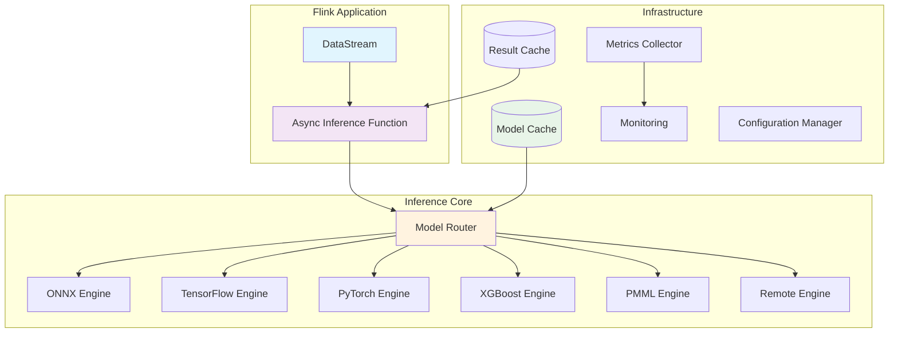
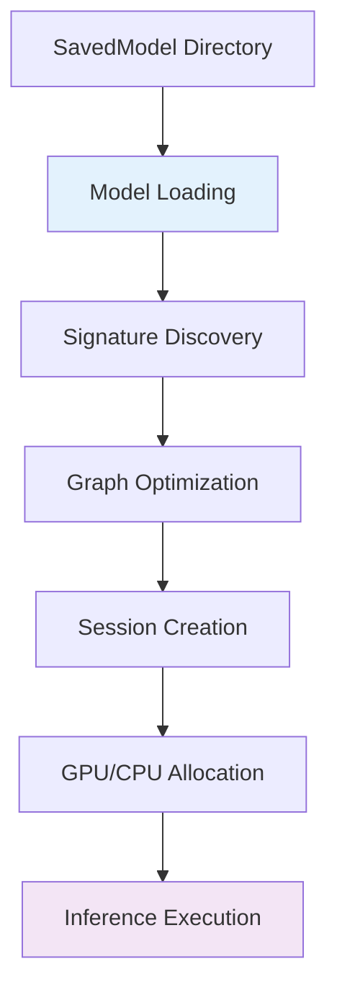
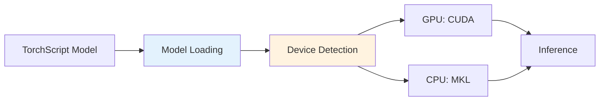
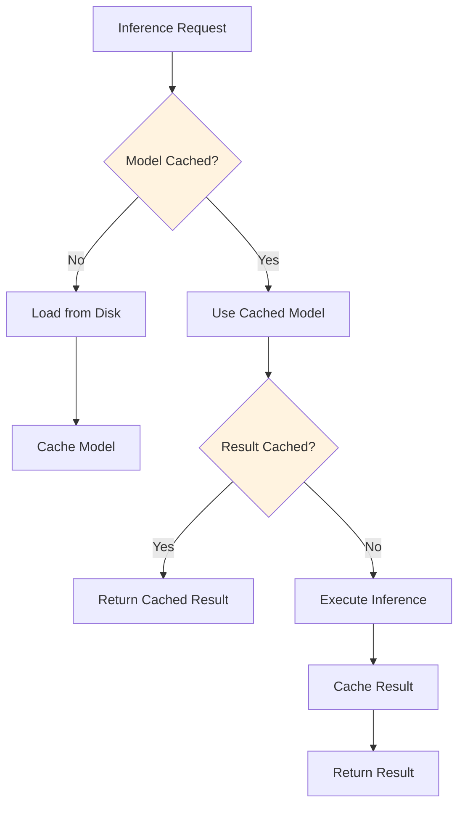
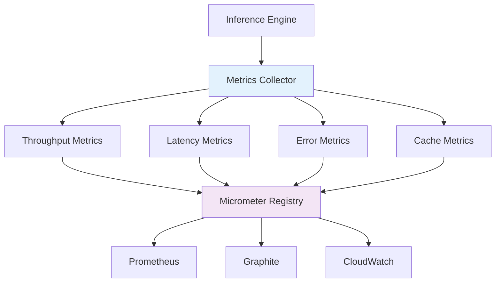
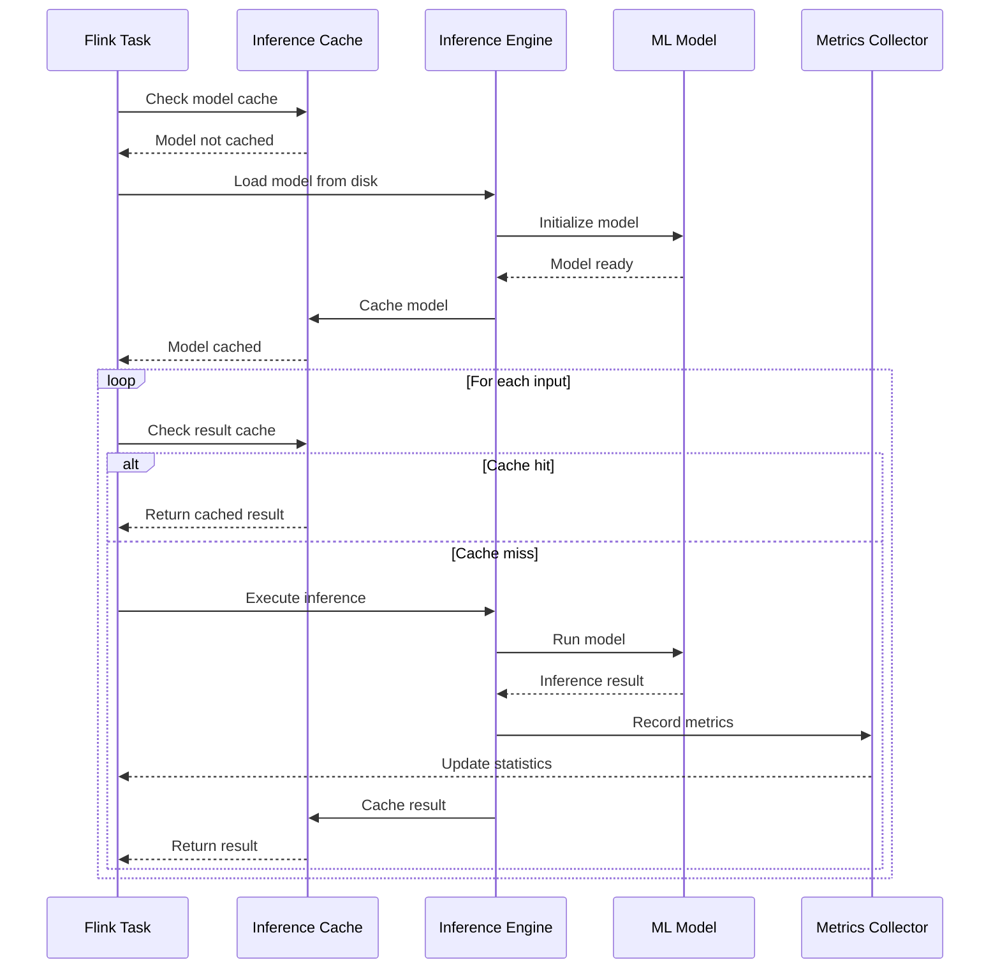
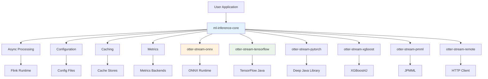

# 🏗️ Otter Streams Architecture

This document describes the architecture and design principles behind Otter Streams, helping you understand how the system works and how to extend it.

##  Design Philosophy

Otter Streams is built on these core principles:

1. **Modular Design**: Each component is independent and replaceable
2. **Async-First**: Non-blocking operations for maximum throughput
3. **Extensible**: Easy to add new model formats and inference engines
4. **Production-Ready**: Built-in monitoring, caching, and fault tolerance
5. **Resource Efficient**: Intelligent batching and memory management

## 📊 System Overview



##  Core Components

### 1. AsyncModelInferenceFunction
The main entry point for integrating ML inference with Flink streams.

```java
public class AsyncModelInferenceFunction<IN, OUT> 
    extends RichAsyncFunction<IN, OUT> {
    
    @Override
    public void asyncInvoke(IN input, ResultFuture<OUT> resultFuture) {
        // Async inference logic
    }
    
    @Override
    public void open(Configuration parameters) {
        // Initialize engine and caches
    }
}
```

**Key Features**:
- Non-blocking async operations
- Automatic batching
- Result caching
- Error handling and retries

### 2. InferenceEngine Interface
The abstraction for all inference engines:

```java
public interface InferenceEngine {
    void initialize(ModelConfig config);
    InferenceOutput execute(Object input);
    InferenceOutput executeBatch(List<Object> inputs);
    Map<String, String> getMetrics();
    void close();
}
```

### 3. Model Configuration System
Centralized configuration management:

```java
@Builder
public class ModelConfig {
    private String modelId;
    private String modelPath;
    private ModelFormat format;
    private Map<String, String> modelOptions;
    private Map<String, String> engineOptions;
    private String signatureName;
    private List<String> inputNames;
    private List<String> outputNames;
}
```

##  Inference Engines

### ONNX Runtime Engine

**Architecture**:


**Features**:
- GPU acceleration support
- Thread pool management
- Memory optimization
- Multiple execution providers

**Configuration**:
```java
ModelConfig.builder()
    .modelOptions(Map.of(
        "executionProvider", "CUDA",
        "intraOpThreads", "4",
        "interOpThreads", "2",
        "optimizationLevel", "ALL"
    ))
    .build();
```

### TensorFlow Engine

**Architecture**:


**Features**:
- SavedModel format support
- Automatic signature detection
- GPU memory management
- TensorFlow Serving compatibility

### PyTorch Engine (Deep Java Library)

**Architecture**:


## 🗄️ Caching System

### Multi-Level Cache Architecture



### Cache Implementation

```java
public class InferenceCache {
    private Cache<String, InferenceEngine> modelCache;
    private Cache<String, InferenceOutput> resultCache;
    
    // Model cache: TTL based, LRU eviction
    // Result cache: Input hash based, configurable TTL
}
```

## 📊 Monitoring & Metrics

### Metrics Collection Architecture



### Available Metrics

```java
public interface InferenceMetrics {
    // Throughput
    String INFERENCE_COUNT = "inference.count";
    String INFERENCE_RATE = "inference.rate";
    
    // Latency
    String INFERENCE_LATENCY = "inference.latency";
    String P50_LATENCY = "inference.latency.p50";
    String P95_LATENCY = "inference.latency.p95";
    String P99_LATENCY = "inference.latency.p99";
    
    // Cache
    String CACHE_HITS = "cache.hits";
    String CACHE_MISSES = "cache.misses";
    String CACHE_HIT_RATIO = "cache.hit.ratio";
    
    // Errors
    String ERROR_COUNT = "error.count";
    String ERROR_RATE = "error.rate";
}
```

##  Data Flow

### End-to-End Flow



##  Performance Optimization

### Batching Strategy

```java
public class SmartBatchingStrategy {
    private int batchSize;
    private Duration batchTimeout;
    private int maxBatchSize;
    
    public List<Object> createBatch(List<Object> inputs) {
        // Dynamic batching based on:
        // 1. Batch size limit
        // 2. Timeout expiration
        // 3. Input similarity
        // 4. System load
    }
}
```

### Memory Management

```java
public class MemoryManager {
    private long maxMemoryBytes;
    private MemoryPool memoryPool;
    
    public void allocateForModel(String modelId, long requiredBytes) {
        // Intelligent allocation with:
        // - Memory pooling
        // - LRU eviction
        // - Fragmentation prevention
    }
}
```

## 🔌 Extension Points

### Creating a Custom Engine

```java
public class CustomInferenceEngine implements InferenceEngine {
    
    @Override
    public void initialize(ModelConfig config) {
        // Initialize your engine
    }
    
    @Override
    public InferenceOutput execute(Object input) {
        // Execute inference
    }
    
    @Override
    public InferenceOutput executeBatch(List<Object> inputs) {
        // Batch execution
    }
}
```

### Registering a New Engine

```java
public class EngineRegistry {
    private static final Map<ModelFormat, Supplier<InferenceEngine>> engines = new HashMap<>();
    
    static {
        engines.put(ModelFormat.ONNX, OnnxInferenceEngine::new);
        engines.put(ModelFormat.TENSORFLOW, TensorFlowInferenceEngine::new);
        // Register your custom engine
        engines.put(ModelFormat.CUSTOM, CustomInferenceEngine::new);
    }
}
```

## 🏗️ Module Dependencies



## 🔮 Future Architecture

### Planned Improvements

1. **Distributed Model Serving**
    - Model sharding across nodes
    - Load balancing
    - Automatic scaling

2. **Feature Store Integration**
    - Real-time feature computation
    - Feature versioning
    - Feature monitoring

3. **A/B Testing Framework**
    - Model version routing
    - Experiment management
    - Performance comparison

---

**Need to extend the architecture?** Check out our [Contributing Guide](CONTRIBUTING.md) for details on adding new features.
