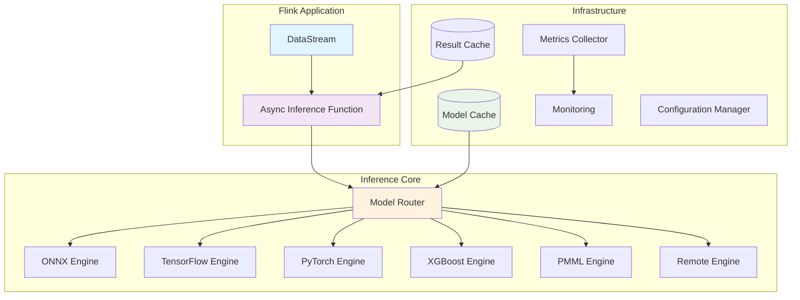
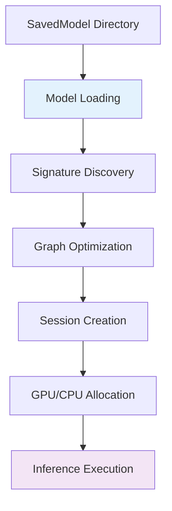
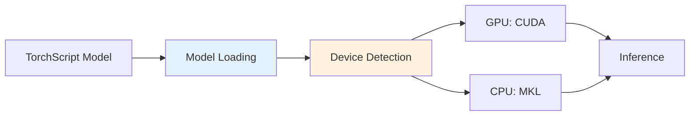
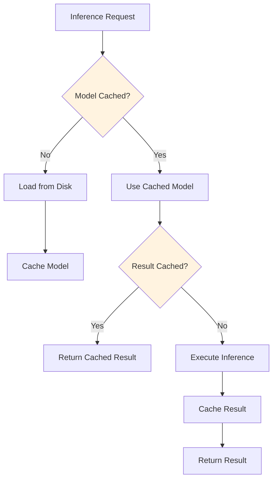
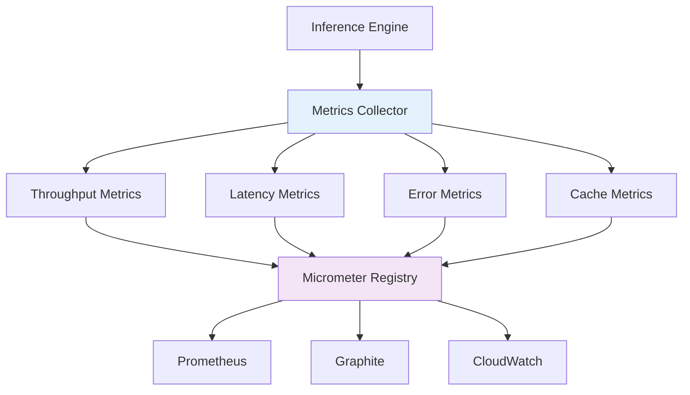
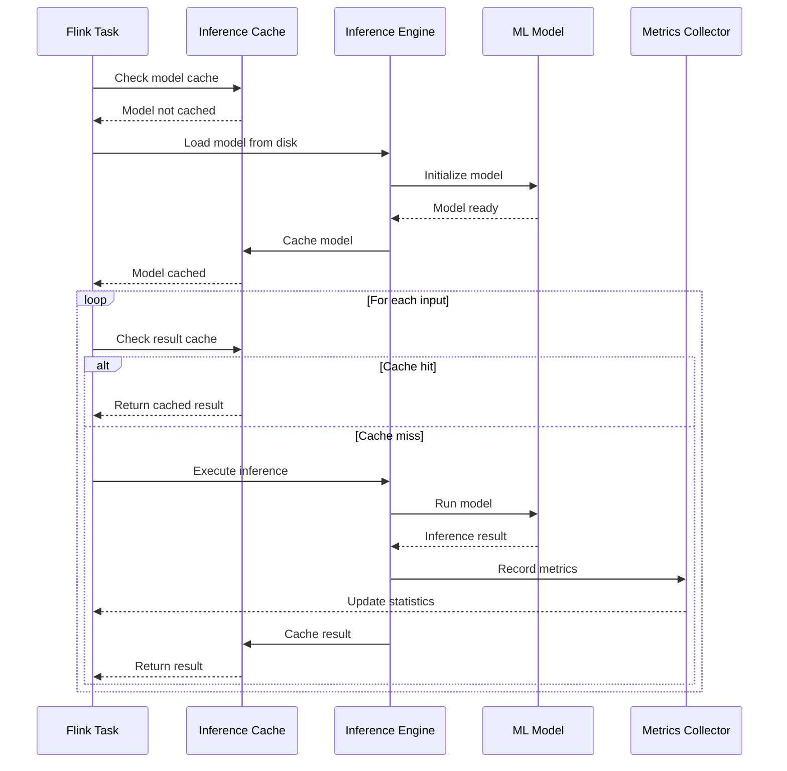
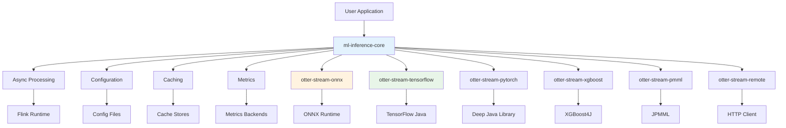

# 🏗️ Otter Streams Architecture

> **This document predates the Runtime layer, Rule Engine, feature store providers, and Otter
> Control Plane** — it describes the original DataStream/SQL inference design and is kept for
> historical context, but some of its code samples (e.g. `InferenceOutput`, a bare `execute()`
> call) no longer match the current public API. **For current architecture, start with:**
> - [`OTTER_STREAMS_OVERVIEW.md`](OTTER_STREAMS_OVERVIEW.md) — what exists today, in one document
> - [`docs/otter-docs/modules.html`](docs/otter-docs/modules.html) — the Runtime Layer, Rule
>   Engine, and per-module reference
> - [`otter-control-plane/ARCHITECTURE.md`](otter-control-plane/ARCHITECTURE.md) — the topology/
>   tracing Control Plane design
>
> The design philosophy and system overview below are still accurate in spirit; treat specific
> class names and code samples as illustrative of the original design intent rather than a
> literal API reference.

This document describes the architecture and design principles behind Otter Streams, helping you understand how the system works and how to extend it.

##  Design Philosophy

Otter Streams is built on these core principles:

1. **Modular Design**: Each component is independent and replaceable
2. **Async-First**: Non-blocking operations for maximum throughput
3. **Extensible**: Easy to add new model formats and inference engines
4. **Production-Ready**: Built-in monitoring, caching, and fault tolerance
5. **Resource Efficient**: Intelligent batching and memory management

## 📊 System Overview


```mermaid
graph TB
    subgraph "Flink Application"
        A[DataStream] --> B[Async Inference Function]
    end
    
    subgraph "Inference Core"
        B --> C[Model Router]
        C --> D[ONNX Engine]
        C --> E[TensorFlow Engine]
        C --> F[PyTorch Engine]
        C --> G[XGBoost Engine]
        C --> H[PMML Engine]
        C --> I[Remote Engine]
    end
    
    subgraph "Infrastructure"
        J[(Model Cache)] --> C
        K[(Result Cache)] --> B
        L[Metrics Collector] --> M[Monitoring]
        N[Configuration Manager]
    end
    
    style A fill:#e1f5fe
    style B fill:#f3e5f5
    style C fill:#fff3e0
    style J fill:#e8f5e8
```

##  Core Components

### 1. AsyncModelInferenceFunction
The main entry point for integrating ML inference with Flink streams.

```java
public class AsyncModelInferenceFunction<IN, OUT> 
    extends RichAsyncFunction<IN, OUT> {
    
    @Override
    public void asyncInvoke(IN input, ResultFuture<OUT> resultFuture) {
        // Async inference logic
    }
    
    @Override
    public void open(Configuration parameters) {
        // Initialize engine and caches
    }
}
```

**Key Features**:
- Non-blocking async operations
- Automatic batching
- Result caching
- Error handling and retries

### 2. InferenceEngine Interface
The abstraction for all inference engines:

```java
public interface InferenceEngine {
    void initialize(ModelConfig config);
    InferenceOutput execute(Object input);
    InferenceOutput executeBatch(List<Object> inputs);
    Map<String, String> getMetrics();
    void close();
}
```

### 3. Model Configuration System
Centralized configuration management:

```java
@Builder
public class ModelConfig {
    private String modelId;
    private String modelPath;
    private ModelFormat format;
    private Map<String, String> modelOptions;
    private Map<String, String> engineOptions;
    private String signatureName;
    private List<String> inputNames;
    private List<String> outputNames;
}
```

##  Inference Engines

### ONNX Runtime Engine

**Architecture**:

```mermaid
graph LR
    A[ONNX Model] --> B[Session Initialization]
    B --> C[Memory Allocation]
    C --> D[Tensor Creation]
    D --> E[Session Run]
    E --> F[Result Extraction]
    F --> G[Memory Cleanup]
    
    style B fill:#e3f2fd
    style E fill:#f3e5f5
```

**Features**:
- GPU acceleration support
- Thread pool management
- Memory optimization
- Multiple execution providers

**Configuration**:
```java
ModelConfig.builder()
    .modelOptions(Map.of(
        "executionProvider", "CUDA",
        "intraOpThreads", "4",
        "interOpThreads", "2",
        "optimizationLevel", "ALL"
    ))
    .build();
```

### TensorFlow Engine

**Architecture**:

```mermaid
graph TB
    A[SavedModel Directory] --> B[Model Loading]
    B --> C[Signature Discovery]
    C --> D[Graph Optimization]
    D --> E[Session Creation]
    E --> F[GPU/CPU Allocation]
    F --> G[Inference Execution]
    
    style B fill:#e3f2fd
    style G fill:#f3e5f5
```

**Features**:
- SavedModel format support
- Automatic signature detection
- GPU memory management
- TensorFlow Serving compatibility

### PyTorch Engine (Deep Java Library)

**Architecture**:

```mermaid
graph LR
    A[TorchScript Model] --> B[Model Loading]
    B --> C[Device Detection]
    C --> D[GPU: CUDA]
    C --> E[CPU: MKL]
    D --> F[Inference]
    E --> F
    
    style B fill:#e3f2fd
    style C fill:#fff3e0
```

## 🗄️ Caching System

### Multi-Level Cache Architecture


```mermaid
graph TB
    A[Inference Request] --> B{Model Cached?}
    B -->|Yes| C[Use Cached Model]
    B -->|No| D[Load from Disk]
    D --> E[Cache Model]
    
    C --> F{Result Cached?}
    F -->|Yes| G[Return Cached Result]
    F -->|No| H[Execute Inference]
    H --> I[Cache Result]
    I --> J[Return Result]
    
    style B fill:#fff3e0
    style F fill:#fff3e0
```

### Cache Implementation

```java
public class InferenceCache {
    private Cache<String, InferenceEngine> modelCache;
    private Cache<String, InferenceOutput> resultCache;
    
    // Model cache: TTL based, LRU eviction
    // Result cache: Input hash based, configurable TTL
}
```

## 📊 Monitoring & Metrics

### Metrics Collection Architecture


```mermaid
graph TB
    A[Inference Engine] --> B[Metrics Collector]
    B --> C[Throughput Metrics]
    B --> D[Latency Metrics]
    B --> E[Error Metrics]
    B --> F[Cache Metrics]
    
    C --> G[Micrometer Registry]
    D --> G
    E --> G
    F --> G
    
    G --> H[Prometheus]
    G --> I[Graphite]
    G --> J[CloudWatch]
    
    style B fill:#e3f2fd
    style G fill:#f3e5f5
```

### Available Metrics

```java
public interface InferenceMetrics {
    // Throughput
    String INFERENCE_COUNT = "inference.count";
    String INFERENCE_RATE = "inference.rate";
    
    // Latency
    String INFERENCE_LATENCY = "inference.latency";
    String P50_LATENCY = "inference.latency.p50";
    String P95_LATENCY = "inference.latency.p95";
    String P99_LATENCY = "inference.latency.p99";
    
    // Cache
    String CACHE_HITS = "cache.hits";
    String CACHE_MISSES = "cache.misses";
    String CACHE_HIT_RATIO = "cache.hit.ratio";
    
    // Errors
    String ERROR_COUNT = "error.count";
    String ERROR_RATE = "error.rate";
}
```

##  Data Flow

### End-to-End Flow


```mermaid
sequenceDiagram
    participant F as Flink Task
    participant IC as Inference Cache
    participant IE as Inference Engine
    participant M as ML Model
    participant MC as Metrics Collector
    
    F->>IC: Check model cache
    IC-->>F: Model not cached
    F->>IE: Load model from disk
    IE->>M: Initialize model
    M-->>IE: Model ready
    IE->>IC: Cache model
    IC-->>F: Model cached
    
    loop For each input
        F->>IC: Check result cache
        alt Cache hit
            IC-->>F: Return cached result
        else Cache miss
            F->>IE: Execute inference
            IE->>M: Run model
            M-->>IE: Inference result
            IE->>MC: Record metrics
            MC-->>F: Update statistics
            IE->>IC: Cache result
            IC-->>F: Return result
        end
    end
```

##  Performance Optimization

### Batching Strategy

```java
public class SmartBatchingStrategy {
    private int batchSize;
    private Duration batchTimeout;
    private int maxBatchSize;
    
    public List<Object> createBatch(List<Object> inputs) {
        // Dynamic batching based on:
        // 1. Batch size limit
        // 2. Timeout expiration
        // 3. Input similarity
        // 4. System load
    }
}
```

### Memory Management

```java
public class MemoryManager {
    private long maxMemoryBytes;
    private MemoryPool memoryPool;
    
    public void allocateForModel(String modelId, long requiredBytes) {
        // Intelligent allocation with:
        // - Memory pooling
        // - LRU eviction
        // - Fragmentation prevention
    }
}
```

## 🔌 Extension Points

### Creating a Custom Engine

```java
public class CustomInferenceEngine implements InferenceEngine {
    
    @Override
    public void initialize(ModelConfig config) {
        // Initialize your engine
    }
    
    @Override
    public InferenceOutput execute(Object input) {
        // Execute inference
    }
    
    @Override
    public InferenceOutput executeBatch(List<Object> inputs) {
        // Batch execution
    }
}
```

### Registering a New Engine

```java
public class EngineRegistry {
    private static final Map<ModelFormat, Supplier<InferenceEngine>> engines = new HashMap<>();
    
    static {
        engines.put(ModelFormat.ONNX, OnnxInferenceEngine::new);
        engines.put(ModelFormat.TENSORFLOW, TensorFlowInferenceEngine::new);
        // Register your custom engine
        engines.put(ModelFormat.CUSTOM, CustomInferenceEngine::new);
    }
}
```

## 🏗️ Module Dependencies


```mermaid
graph TD
    A[User Application] --> B[ml-inference-core]
    
    B --> C[Async Processing]
    B --> D[Configuration]
    B --> E[Caching]
    B --> F[Metrics]
    
    C --> G[Flink Runtime]
    D --> H[Config Files]
    E --> I[Cache Stores]
    F --> J[Metrics Backends]
    
    B --> K[otter-stream-onnx]
    B --> L[otter-stream-tensorflow]
    B --> M[otter-stream-pytorch]
    B --> N[otter-stream-xgboost]
    B --> O[otter-stream-pmml]
    B --> P[otter-stream-remote]
    
    K --> Q[ONNX Runtime]
    L --> R[TensorFlow Java]
    M --> S[Deep Java Library]
    N --> T[XGBoost4J]
    O --> U[JPMML]
    P --> V[HTTP Client]
    
    style B fill:#e3f2fd
    style K fill:#fff3e0
    style L fill:#e8f5e8
```

## 🔮 Future Architecture

### Planned Improvements — status update

The three items originally listed here are now implemented, each with real scope boundaries
worth reading before you rely on them — see each module's own README for the full picture.

1. **Distributed Model Serving** — `ml-inference-core`'s `runtime.serving` package
   (`ReplicaPool`, `LoadBalancingStrategy` with round-robin/least-connections implementations,
   `ReplicaAutoScaler`).
    - Model sharding across nodes — **not what this builds.** Cross-node distribution already
      happens via Flink's own parallelism/scheduling (`OtterRuntime` is deliberately an embedded,
      per-TaskManager runtime) and via the Control Plane's command fan-out across every
      TaskManager instance serving a model. What's built here is **in-process replica pooling**
      — multiple engine instances of the same model version within one JVM, for when a single
      instance can't keep up with one subtask's throughput. Literal model-weight sharding
      (splitting one model too large for a single machine) is a different, much larger problem
      this project's target model sizes don't call for. See `ReplicaPool`'s class Javadoc.
    - Load balancing — implemented (round-robin, least-connections).
    - Automatic scaling — implemented, genuinely bidirectional (unlike GPU auto-scaling, in
      -flight count is a real present-tense signal for both scale-up and scale-down — see
      `ReplicaAutoScaler`'s class Javadoc for why that distinction matters).

2. **Feature Store Integration** — `ml-inference-core`'s `runtime.feature` package, on top of
   the existing Redis/JDBC/Feast providers (`otter-stream-feature-*`).
    - Real-time feature computation — `SlidingWindowFeatureProvider`: genuinely computes an
      aggregate (count/sum/avg/min/max) over a rolling time window from values you `record()` as
      events arrive, not a cached lookup of something computed elsewhere.
    - Feature versioning — `VersioningFeatureProvider` stamps a version tag onto every fetch.
      Scoped honestly: this is fetch-time stamping, **not** point-in-time historical correctness
      (Feast's offline store does that; a plain Redis hash or JDBC table generally can't) — see
      `FeatureVersion`'s class Javadoc.
    - Feature monitoring — `MonitoredFeatureProvider`: wraps any provider with latency/error-rate
      tracking, mirroring `RuleMetricsSnapshot`'s shape for consistency.

3. **A/B Testing Framework** — new module `otter-stream-experiments`.
    - Model version routing — reuses `OtterRuntime`'s existing canary mechanism
      (`LifecycleManager.deployCanary`, Milestone 6) rather than reimplementing traffic
      splitting.
    - Experiment management — `ExperimentManager`: named experiments, one running per model at a
      time, outcome recording, promote/rollback tied to the underlying canary.
    - Performance comparison — `StatisticalTest`: Welch's t-test (continuous metrics) and a
      two-proportion z-test (conversion/flag-rate metrics), implemented without a math library
      dependency. Read the p-value approximation caveat in its class Javadoc before treating a
      result as exact for small samples.

**How to validate any of this yourself:** `otter-benchmarks` (JMH) measures the routing/rule
-evaluation/load-balancing overhead in isolation; see its README for what it does and doesn't
tell you, plus guidance for real end-to-end and HTTP-load benchmarking beyond what JMH covers.

---

**Need to extend the architecture?** Check out our [Contributing Guide](CONTRIBUTING.md) for details on adding new features.
