# Otter Streams - Real-time ML Inference for Apache Flink
<p align="center">
  
</p>


**Production-grade machine learning inference library for Apache Flink** with support for multiple ML frameworks and deployment modes. Perform real-time model inference on streaming data with enterprise-grade features.

## 🚀 Overview

Otter Streams enables seamless integration of machine learning models into Apache Flink streaming pipelines. Whether you're doing fraud detection, real-time recommendations, or anomaly detection, this framework provides the tools to deploy ML models at scale with minimal latency.

### Key Features

- 🎯 **Multi-Framework Support**: ONNX, TensorFlow, PyTorch, XGBoost, PMML
- 🌐 **Flexible Deployment**: Local, HTTP, gRPC, and cloud AI platforms
- ⚡ **High Performance**: Async inference, batching, and intelligent caching
- 📊 **Production Ready**: Metrics, monitoring, retry logic, and error handling
- 🔧 **Enterprise Grade**: Thread-safe, configurable, and extensible architecture

## 🏗️ Architecture Overview


## 📦 Modules & Use Cases

### Core Module (`ml-inference-core`)
**Foundation for all inference operations**


**Use Cases**: Base for all ML inference pipelines, custom engine development

### ONNX Runtime (`otter-stream-onnx`)
**Universal model format support**


**Supported Formats**: `.onnx`
**Use Cases**: Cross-framework model deployment, standardized inference

### TensorFlow (`otter-stream-tensorflow`)
**Native TensorFlow model execution**


**Supported Formats**: `saved_model.pb`, TensorFlow Hub models
**Use Cases**: Real-time computer vision, NLP models, existing TF ecosystems

### PyTorch (`otter-stream-pytorch`)
**PyTorch model inference via DJL**


**Supported Formats**: `.pt`, `.pth` (TorchScript)
**Use Cases**: Research models, custom architectures, dynamic graphs

### XGBoost (`otter-streams-xgboost`)
**Gradient boosting for tabular data**


**Supported Formats**: `.model`, `.xgb`, `.ubj`
**Use Cases**: Fraud detection, credit scoring, recommendation systems

### PMML (`otter-stream-pnnnl`)
**Standardized model format support**


**Supported Formats**: `.pmml`, `.xml`
**Use Cases**: Enterprise ML systems, standardized model exchange

### Remote Inference (`otter-stream-remote`)
**Cloud and external service integration**


**Use Cases**: Cloud ML services, existing model endpoints, hybrid deployments

## ⚡ Quick Start

### Installation

Add the core dependency to your `pom.xml`:

```xml
<dependency>
    <groupId>com.codedstreams</groupId>
    <artifactId>ml-inference-core</artifactId>
    <version>1.0.0</version>
</dependency>
```

Add framework-specific modules as needed:

```xml
<dependency>
    <groupId>com.codedstreams</groupId>
    <artifactId>otter-stream-onnx</artifactId>
    <version>1.0.0</version>
</dependency>
```

### Basic Usage

```java
// 1. Configure your model
InferenceConfig config = InferenceConfig.builder()
    .modelConfig(ModelConfig.builder()
        .modelId("fraud-detection")
        .modelPath("models/fraud_model.onnx")
        .format(ModelFormat.ONNX)
        .modelName("fraud_predictor")
        .modelVersion("2.1")
        .build())
    .batchSize(32)                    // Optimize throughput
    .timeout(Duration.ofSeconds(5))   // Request timeout
    .maxRetries(3)                    // Automatic retry
    .enableMetrics(true)              // Performance monitoring
    .enableCaching(true)              // Result caching
    .build();

// 2. Create inference function
AsyncModelInferenceFunction<Transaction, FraudScore> inferenceFunction =
    new AsyncModelInferenceFunction<>(
        config,
        cfg -> new OnnxInferenceEngine()
    );

// 3. Integrate with Flink stream
DataStream<FraudScore> predictions = AsyncDataStream.unorderedWait(
    transactionStream,
    inferenceFunction,
    5000,                            // Async timeout
    TimeUnit.MILLISECONDS,
    100                              // Max concurrent requests
);
```

## 🎯 Real-world Examples

### Fraud Detection Pipeline


### Real-time Recommendation


### Anomaly Detection

```mermaid
graph TB
    A[IoT Sensor Data] --> B[Window<br/>Aggregation]
    B --> C[Anomaly Detection<br/>Model]
    C --> D{Normal?}
    D -->|Yes| E[Continue Monitoring]
    D -->|No| F[🚨 Trigger Alert]
    
    style C fill:#fff3e0
    style F fill:#ffebee
```



## 🔧 Configuration Examples

### Local Model Inference

```java
InferenceConfig.builder()
    .modelConfig(ModelConfig.builder()
        .modelId("sentiment-analysis")
        .modelPath("/models/sentiment.onnx")
        .format(ModelFormat.ONNX)
        .modelOptions(Map.of(
            "interOpThreads", 4,
            "intraOpThreads", 2,
            "optimizationLevel", "ALL"
        ))
        .build())
    .batchSize(64)
    .enableCaching(true)
    .cacheSize(10000)
    .build();
```

### Remote HTTP Endpoint

```java
InferenceConfig.builder()
    .modelConfig(ModelConfig.builder()
        .modelId("cloud-model")
        .format(ModelFormat.REMOTE_HTTP)
        .endpointUrl("https://api.example.com/v1/predict")
        .authConfig(AuthConfig.builder()
            .apiKey("your-api-key")
            .headers(Map.of(
                "Content-Type", "application/json",
                "X-Custom-Header", "value"
            ))
            .build())
        .build())
    .timeout(Duration.ofSeconds(10))
    .maxRetries(3)
    .build();
```

### AWS SageMaker Integration

```java
InferenceConfig.builder()
    .modelConfig(ModelConfig.builder()
        .modelId("sagemaker-endpoint")
        .format(ModelFormat.SAGEMAKER)
        .endpointUrl("my-production-endpoint")
        .authConfig(AuthConfig.builder()
            .apiKey("AKIA...:secret-key")
            .build())
        .build())
    .build();
```

## 📊 Performance Features

### Async Processing
```java
// Non-blocking inference with backpressure
AsyncDataStream.unorderedWait(
    stream,
    inferenceFunction,
    5000,           // Timeout
    TimeUnit.MILLISECONDS,
    100             // Max concurrent requests
);
```

### Intelligent Batching
```java
InferenceConfig.builder()
    .batchSize(32)              // Batch size
    .batchTimeout(Duration.ofMillis(100))  // Max wait time
    .build();
```

### Result Caching
```java
InferenceConfig.builder()
    .enableCaching(true)
    .cacheSize(10000)           // Cache entries
    .cacheTtl(Duration.ofMinutes(10))  // Time-to-live
    .build();
```

## 🛠️ Development

### Building from Source

```bash
# Clone repository
git clone https://github.com/YOUR_USERNAME/otter-streams.git
cd otter-streams

# Build project
./setup.sh

# Run tests
mvn test

# Build specific module
mvn clean install -pl otter-stream-onnx
```

### Module Dependencies


## 📈 Monitoring & Metrics

The framework automatically collects comprehensive metrics:

- **Throughput**: Inferences per second
- **Latency**: P50, P95, P99 inference times
- **Cache Performance**: Hit/miss ratios
- **Error Rates**: Failed inference percentage
- **Resource Usage**: Memory and CPU utilization

```java
// Enable detailed metrics
InferenceConfig.builder()
    .enableMetrics(true)
    .metricsPrefix("myapp.ml.inference")
    .collectLatencyMetrics(true)
    .collectThroughputMetrics(true)
    .build();
```

## 🔮 Roadmap

- [ ] **v1.1**: gRPC support, Kubernetes operator
- [ ] **v1.2**: Model versioning, A/B testing
- [ ] **v1.3**: Feature store integration
- [ ] **v2.0**: Distributed model serving, auto-scaling

## 🤝 Contributing

We welcome contributions! Please see our [Contributing Guide](CONTRIBUTING.md) for details.

1. Fork the repository
2. Create a feature branch
3. Add tests for your changes
4. Submit a pull request

## 📄 License

This project is licensed under the Apache License 2.0 - see the [LICENSE](LICENSE) file for details.

## 🆘 Support

- 📚 [Documentation](https://YOUR_USERNAME.github.io/otter-streams/)
- 🐛 [Issue Tracker](https://github.com/YOUR_USERNAME/otter-streams/issues)
- 💬 [Discussions](https://github.com/YOUR_USERNAME/otter-streams/discussions)
- 📧 [Email Support](mailto:nestorabiawuh@gmail.com)

---

<div align="center">

**Built with ❤️ for the Apache Flink community**

[Getting Started](GETTING_STARTED.md) • [Examples](otter-stream-examples/) • [API Docs](https://martourez21.github.io/otter-streams/javadoc/)

</div>