# Otter Stream - Technical Documentation

## Architecture Overview

Otter Stream is a production-grade ML inference library for Apache Flink, designed for real-time machine learning predictions in streaming data pipelines.

### High-Level Architecture

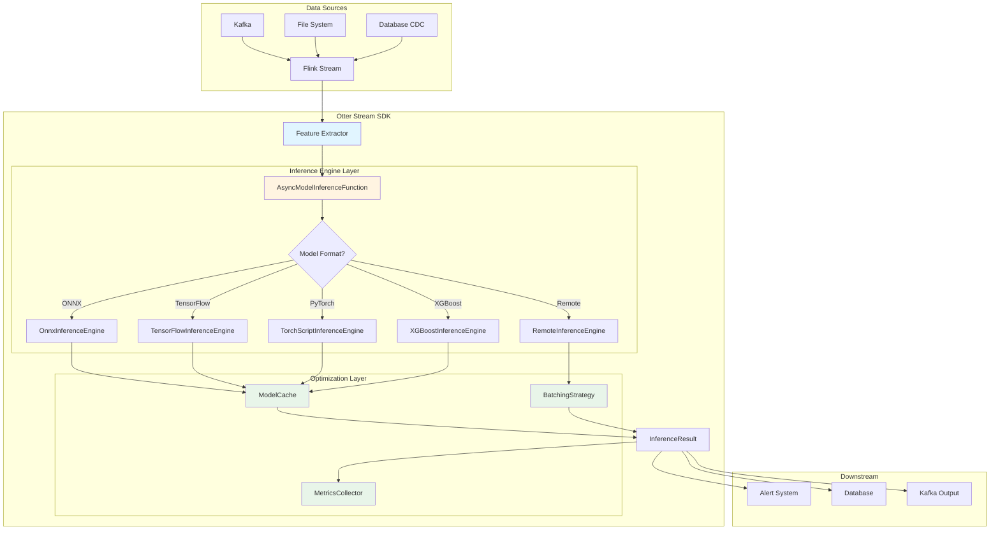

### Component Architecture

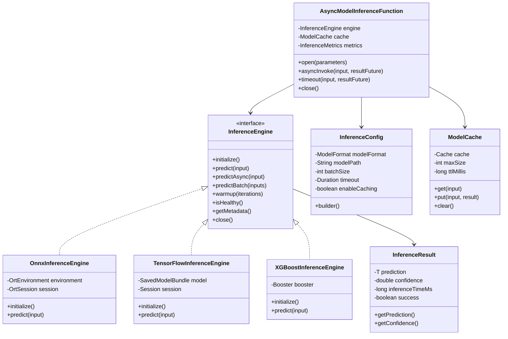

## Data Flow

### Synchronous Inference Flow

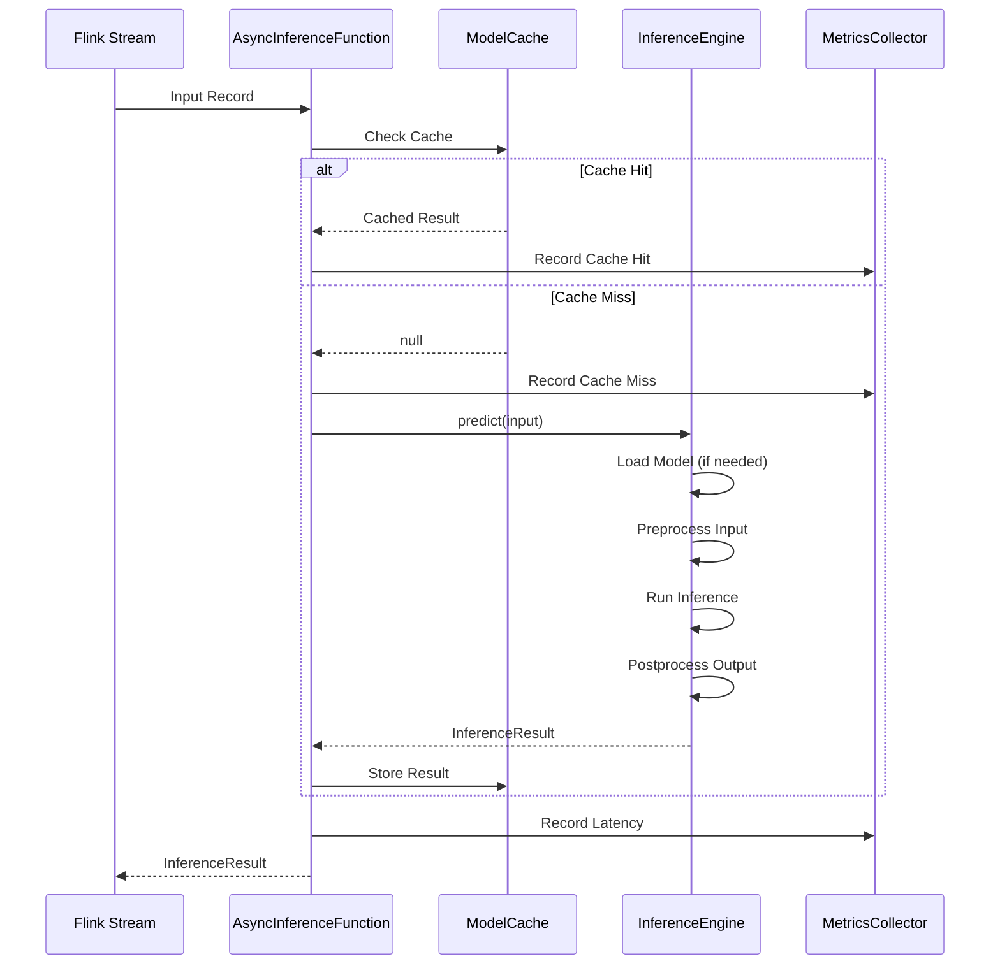

### Batch Inference Flow

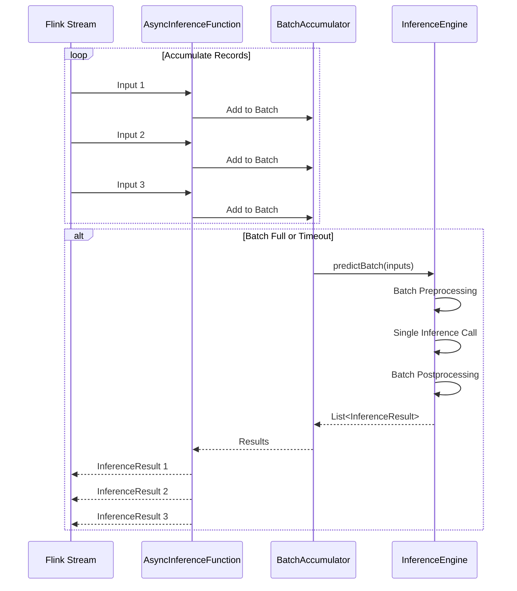

## Module Structure

### Core Module Architecture

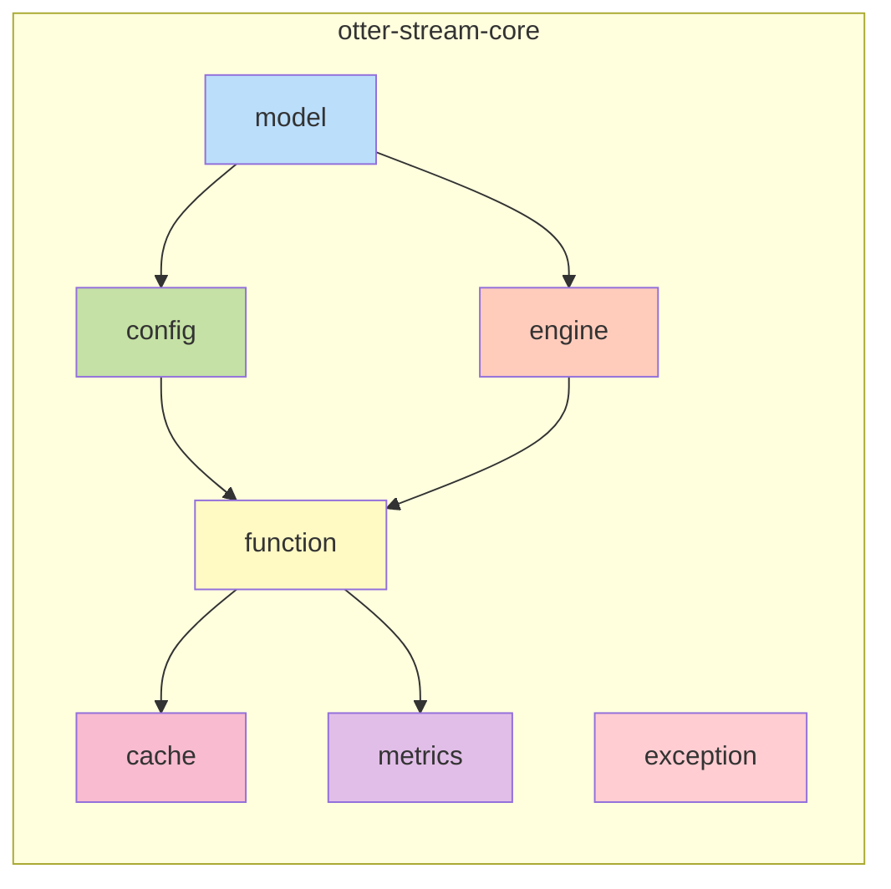

### Module Dependencies

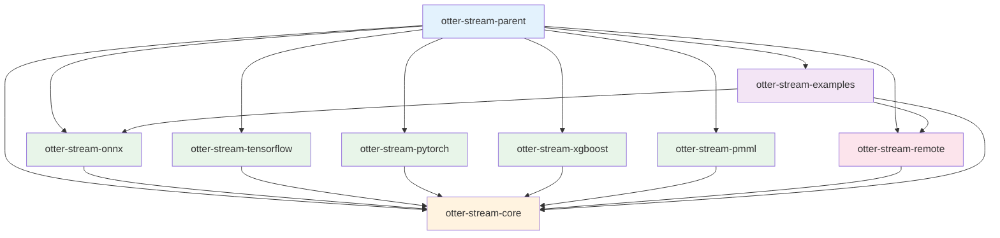

## Inference Engine Lifecycle

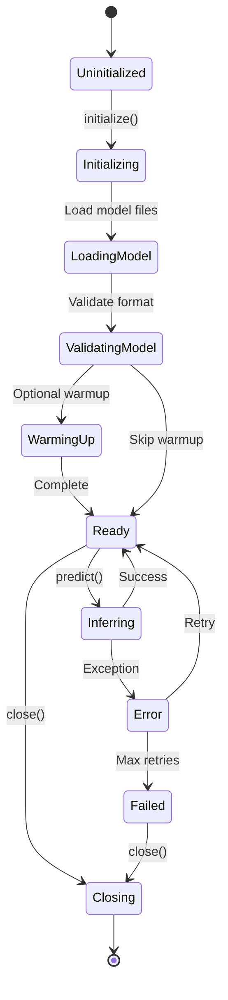

## Remote Inference Architecture

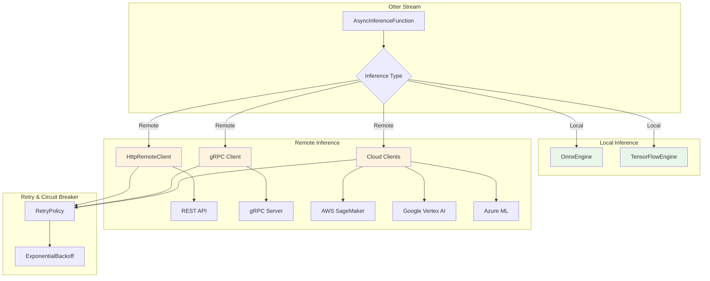

## Caching Strategy

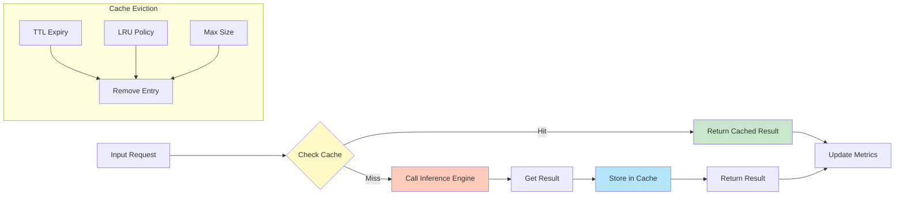

## Performance Optimization

### Batching Strategy

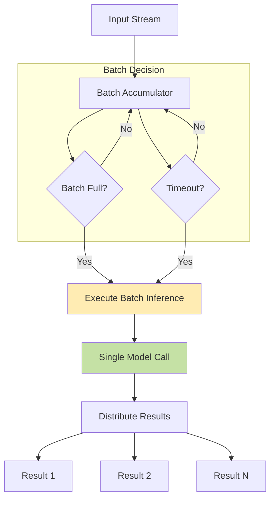

### Parallel Processing

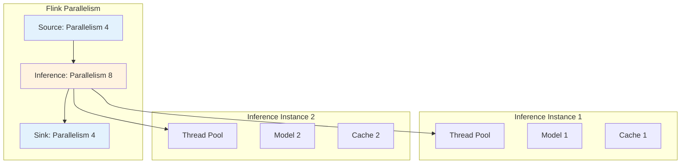

## Metrics Collection

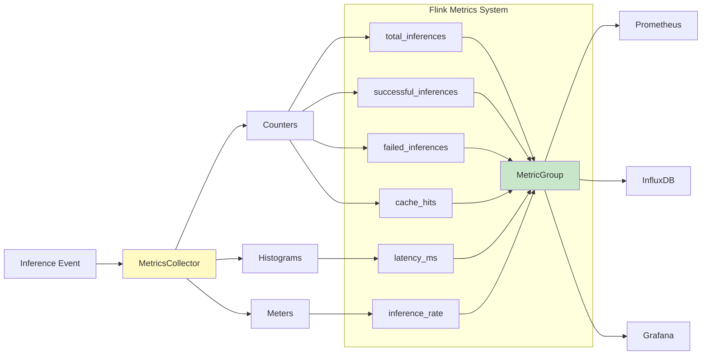

## Error Handling Flow

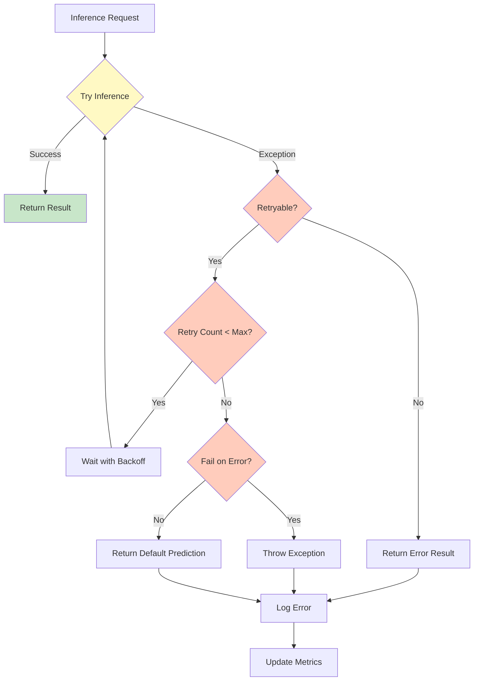

## Deployment Architecture

### Local Deployment

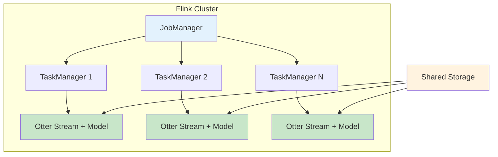

### Cloud Deployment

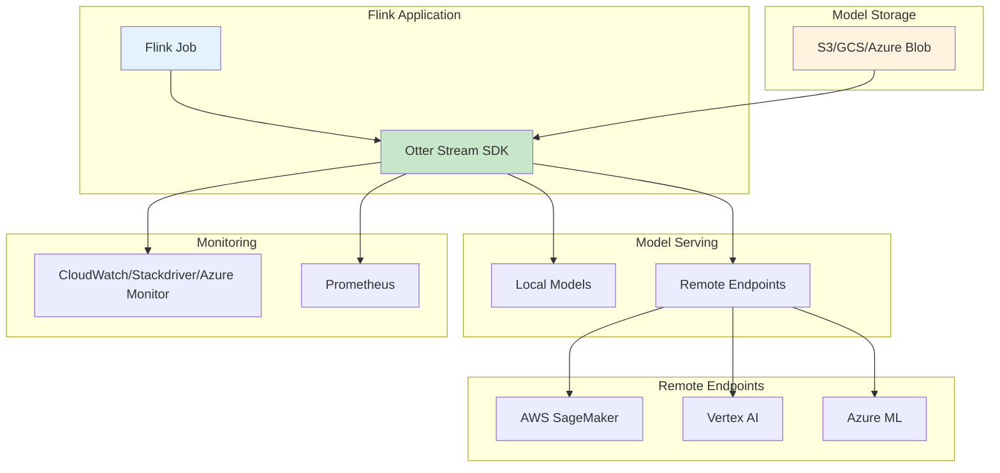

## Configuration Flow

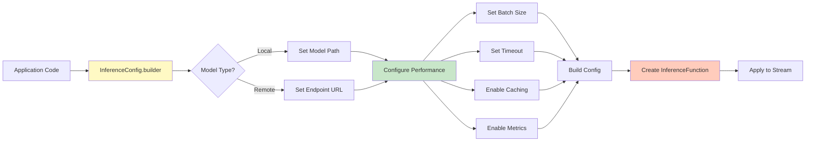

## Model Loading Strategies

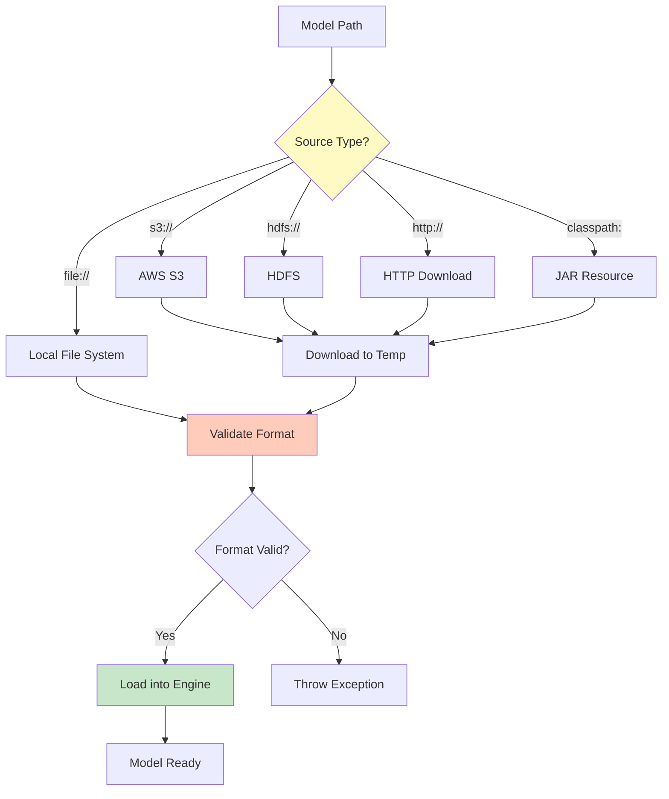

## Thread Safety Model

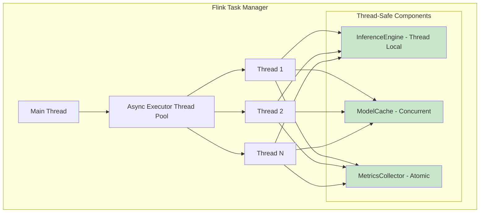

## Extension Points

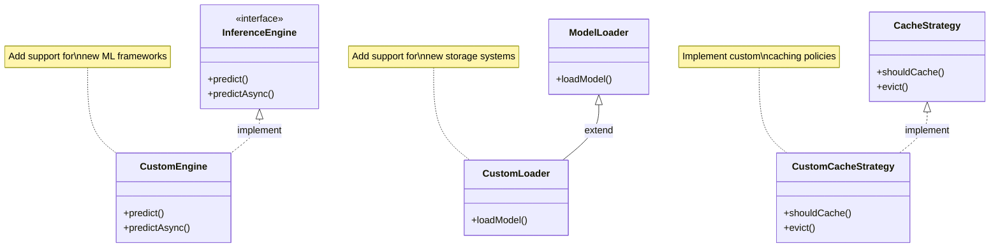

## Performance Characteristics

### Latency Breakdown

```mermaid
gantt
    title Inference Latency Components
    dateFormat X
    axisFormat %L ms
    
    section Single Inference
    Input Deserialization :0, 5
    Cache Lookup :5, 10
    Model Inference :10, 100
    Output Serialization :100, 105
    
    section Batch Inference (32 items)
    Input Deserialization :0, 10
    Cache Lookup :10, 20
    Batch Model Inference :20, 150
    Output Serialization :150, 160
```

### Throughput Comparison

```mermaid
graph LR
    A[Configuration] --> B{Strategy}
    
    B -->|No Batching| C[1000 req/sec]
    B -->|Batch Size 32| D[8000 req/sec]
    B -->|Batch + Cache| E[15000 req/sec]
    
    style C fill:#ffccbc
    style D fill:#fff9c4
    style E fill:#c8e6c9
```

## Technical Specifications

### Supported Java Versions
- Java 11 (LTS) - Primary
- Java 17 (LTS) - Supported

### Flink Compatibility
- Apache Flink 1.18.x
- Compatible with Flink 1.17.x and 1.19.x

### Concurrency Model
- Async I/O with Flink's Async Function API
- Configurable thread pools per operator
- Thread-safe model instances

### Memory Management
- Model loaded once per task manager
- Configurable cache sizes with LRU eviction
- Automatic memory cleanup on task failure

### Fault Tolerance
- Checkpointing support
- Model reload on task restart
- Exactly-once semantics (with Kafka/Pulsar)

## Integration Patterns

### Pattern 1: Feature Store Integration

```mermaid
sequenceDiagram
    participant Kafka
    participant Flink
    participant FeatureStore
    participant OtterStream
    participant OutputSink
    
    Kafka->>Flink: Raw Event
    Flink->>FeatureStore: Lookup Features
    FeatureStore-->>Flink: Feature Vector
    Flink->>OtterStream: predict(features)
    OtterStream-->>Flink: Prediction
    Flink->>OutputSink: Enriched Event + Prediction
```

### Pattern 2: Model A/B Testing

```mermaid
graph LR
    A[Input Stream] --> B{Random Split}
    B -->|90%| C[Model A v1.0]
    B -->|10%| D[Model B v2.0]
    
    C --> E[Results with Model Tag]
    D --> E
    
    E --> F[Metrics Analysis]
    
    style C fill:#c8e6c9
    style D fill:#fff9c4
```

### Pattern 3: Ensemble Models

```mermaid
graph TD
    A[Input Features] --> B[Model 1: ONNX]
    A --> C[Model 2: XGBoost]
    A --> D[Model 3: TensorFlow]
    
    B --> E[Aggregator]
    C --> E
    D --> E
    
    E --> F{Ensemble Strategy}
    F -->|Average| G[Final Prediction]
    F -->|Weighted| G
    F -->|Voting| G
    
    style E fill:#fff9c4
    style G fill:#c8e6c9
```

## Glossary

- **Inference**: The process of using a trained ML model to make predictions
- **Async I/O**: Non-blocking I/O operations that don't block Flink's main thread
- **Batching**: Accumulating multiple requests to process together for efficiency
- **Cache Hit**: When a prediction is found in cache without invoking the model
- **Model Warmup**: Running initial predictions to optimize JIT compilation
- **Backpressure**: Flink's flow control mechanism to prevent overwhelming downstream
- **Watermark**: Flink's mechanism for tracking event time progress
- **Task Manager**: Flink worker process that executes tasks
- **Job Manager**: Flink coordinator that manages the cluster and jobs

## References

- [Apache Flink Documentation](https://flink.apache.org/docs/)
- [ONNX Runtime Java API](https://onnxruntime.ai/docs/api/java/)
- [TensorFlow Java](https://www.tensorflow.org/jvm)
- [Deep Java Library (DJL)](https://djl.ai/)