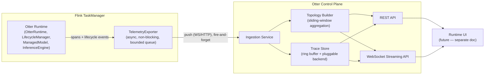
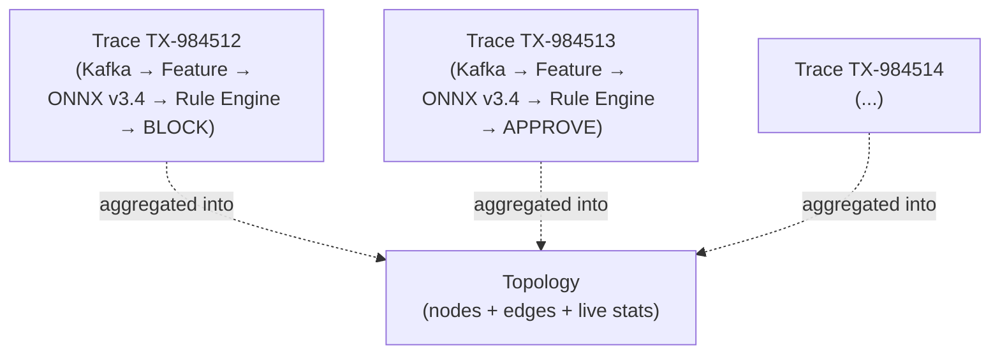
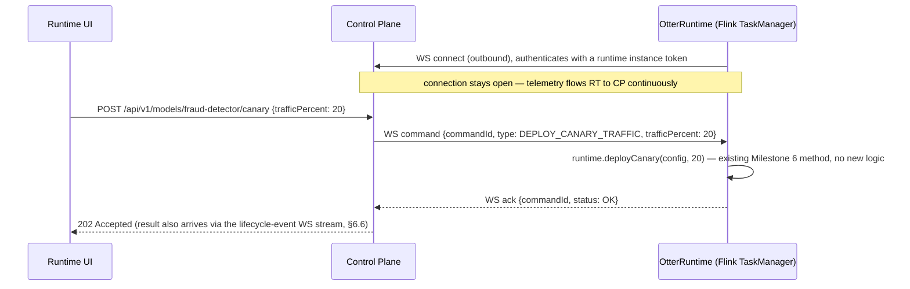
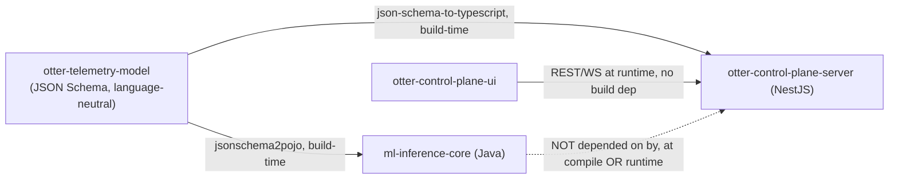

# 🛰️ Otter Control Plane — Architecture

**Status:** Design phase. Nothing in this document is implemented yet. No Java code,
Maven module, NestJS project, or `package.json`/`pom.xml` exists for `otter-control-plane` —
this file *is* the module, for now. The four open questions from the first draft (control
commands, multi-runtime node merging, cold-tier storage, server framework) are resolved — see
§16 for the decisions log.

This document specifies the AI Inference Topology & Observability feature: a live topology
graph, distributed tracing, and operational dashboards for models running inside Otter
Runtime, plus the architectural split (**Otter Runtime** vs **Otter Control Plane**) that
makes it possible without weighing down the inference hot path.

---

## 1. Vision & Scope

Today, `OtterRuntime` (Milestones 1–7) answers "can I deploy, hot-swap, canary, and shadow a
model safely?" This document answers a different question: **"can an operator *see* what's
happening, in real time, across every model, every version, every transaction?"**

Concretely, this feature should let an operator answer:

- Where is latency increasing, and in which stage of the pipeline?
- Which model version handled *this specific* transaction?
- Why was a payment blocked? (full causal trace, not just a log line)
- Which `InferenceProvider` executed the inference — ONNX? Remote? CPU or GPU?
- Is the GPU saturated? Is the result cache effective?
- Is a canary behaving like production, or diverging?
- Should we roll back the deployment we just made?

This is **not** a metrics table. It's a live, animated topology graph (à la Flink's execution
graph or a service-mesh dashboard) with per-transaction tracing (à la Jaeger/Zipkin), purpose
-built around AI inference semantics — model version, confidence, provider, GPU — rather than
generic RPC semantics.

### 1.1 Explicitly in scope for this design

- Live topology graph of inference pipelines (nodes = pipeline stages, edges = data flow)
- Per-transaction distributed tracing, rooted at the inference call
- Shadow/canary visualization (two models processing the same events, side by side)
- Model lifecycle timeline (load → warm → swap → retire, rollback markers)
- Provider/GPU/cache health dashboards
- The Runtime → Control Plane data path and the SPI that makes it pluggable

### 1.2 Explicitly out of scope for this design (see §14)

- The actual web UI implementation (this doc defines the API/data contract it renders;
  `ui-architecture.md` is a follow-up doc, not this one)
- RBAC / OAuth2 / multi-tenancy (v0.6 territory per the product roadmap)
- Long-term trace storage backend selection (Elasticsearch vs. ClickHouse vs. Cassandra —
  pluggable, decided later, see §6.3)
- Kubernetes operator / autoscaling for the control plane itself

---

## 2. Two-Part System: Otter Runtime vs. Otter Control Plane

This is the single most important architectural decision in this document, so it's worth
stating plainly: **the Control Plane is a separate deployable that the Runtime knows almost
nothing about.**

| | **Otter Runtime** | **Otter Control Plane** |
|---|---|---|
| **Where it runs** | Embedded inside Flink TaskManagers (or sidecar/cluster — see §12) | Independent service(s), anywhere |
| **What it does** | Executes inference, manages model lifecycle (Milestones 1–7) | Ingests telemetry, builds the live topology, stores traces, serves the UI/API |
| **Failure mode if the other side is down** | Keeps serving inference; telemetry is dropped (never blocks) | Shows stale/no data; never affects inference |
| **New module** | *(existing)* `ml-inference-core` + provider/feature modules | *(new)* `otter-control-plane` |
| **Compile-time coupling** | Depends on nothing new — just gains one additive SPI (§5.1) | Depends only on a tiny shared schema module (§11.2), never on `ml-inference-core` |



**Why this split, specifically:**

1. **Inference latency must never depend on the control plane's availability or load.**
   If the topology UI is down, or the control plane is overwhelmed, transactions keep flowing
   through `OtterRuntime` exactly as today. This is why exporting is async and drop-on-backpressure
   (§5.3), never a blocking call in the `infer()` path.
2. **One control plane, many runtimes.** An operator running 200 Flink jobs across a cluster
   wants one topology view, not 200 dashboards. The control plane is designed to ingest from
   many `OtterRuntime` instances concurrently from day one.
3. **Independent evolution and scaling.** The UI/API can add features, redeploy, and scale
   without touching a running Flink job. This mirrors how Flink itself separates the
   JobManager/TaskManager runtime from the Flink Web UI.

---

## 3. Core Concepts: Topology, Trace, Span

Borrowing deliberately from distributed tracing (OpenTelemetry's data model), specialized for
AI inference:

- **Span** — one unit of work with a start time, duration, and outcome (e.g. "feature lookup
  for entity 42", "ONNX inference for fraud-model v3.4"). Spans nest: an inference span is a
  child of the request span, which is a child of the Kafka-consume span.
- **Trace** — the full tree of spans for one transaction, from ingestion to decision. This is
  what the per-transaction trace view (§9) renders.
- **Topology node** — a *kind* of span, aggregated: "Feature Enrichment", "Fraud Model v3.2".
  Not one instance — the durable node you see sitting in the graph.
- **Topology edge** — an aggregated flow between two node kinds, annotated with a sliding-window
  throughput/latency/error rate (§7).

The relationship: **many traces roll up into one topology.** The topology is the live,
continuously-updated aggregate view; a trace is one transaction's frozen, expandable detail
view you drill into by clicking a topology edge or an individual event.



---

## 4. Data Model

These are the wire/storage schemas the whole feature is built on. Defined here as the shared
contract between Runtime and Control Plane — deliberately framework-agnostic (no Flink or
Jackson types), since it lives in the shared schema module (§11.2) that both sides depend on.

### 4.1 `Span`

| Field | Type | Notes |
|---|---|---|
| `spanId` | string | Unique per span |
| `traceId` | string | Groups spans into one trace |
| `parentSpanId` | string, nullable | Null for the root span |
| `nodeKind` | string | e.g. `"feature-lookup"`, `"inference:onnx"`, `"rule-engine"` — maps to a topology node |
| `modelId` / `modelVersion` | string, nullable | Populated for inference spans |
| `provider` | string, nullable | e.g. `"onnx"`, `"remote-http"` — from `InferenceProvider.getProviderId()` |
| `executionTarget` | string, nullable | e.g. `"CPU"`, `"CUDA:0"` |
| `startTimeMillis` / `durationMicros` | long | |
| `outcome` | enum | `OK`, `ERROR`, `TIMEOUT` |
| `confidence` | double, nullable | For inference spans that produce a score |
| `attributes` | map\<string,string\> | Free-form (entity id, decision, cache hit/miss, ...) |

### 4.2 `Trace`

A `Trace` is not stored as its own object — it's the set of `Span`s sharing a `traceId`,
assembled on read. (See §6.3 on why: write-path simplicity, and traces are read far less often
than spans are written.)

### 4.3 `TopologyNode`

| Field | Type | Notes |
|---|---|---|
| `nodeKind` | string | Identity — matches `Span.nodeKind` |
| `displayName` | string | e.g. `"Fraud Model v3.2"` |
| `health` | enum | `HEALTHY`, `DEGRADED`, `BACKPRESSURE`, `ERROR`, `STOPPED` (§7.3) |
| `p50Micros` / `p99Micros` | long | Sliding-window latency |
| `throughputPerSec` | double | Sliding-window |
| `errorRatePercent` | double | Sliding-window |
| `activeModelVersions` | list\<string\> | Non-empty only for model nodes; supports canary (two versions active at once) |

### 4.4 `TopologyEdge`

| Field | Type | Notes |
|---|---|---|
| `fromNodeKind` / `toNodeKind` | string | |
| `throughputPerSec` | double | |
| `avgLatencyMicros` | long | |
| `backpressurePercent` | double | Derived from queue depth if the runtime reports it |
| `failureCount` (window) | long | |

### 4.5 `ModelLifecycleEvent`

This is the direct wire representation of events Otter Runtime *already* produces internally —
see §5.2. No new runtime logic is needed to populate this; it's a serialization of existing
`LifecycleListener`/`ShadowListener` callbacks.

| Field | Type | Notes |
|---|---|---|
| `modelId` / `version` | string | |
| `eventType` | enum | `VALIDATING`, `WARMING`, `ACTIVATED`, `RETIRED`, `FAILED`, `CANARY_DEPLOYED`, `CANARY_PROMOTED`, `CANARY_ROLLED_BACK`, `SHADOW_DEPLOYED`, `SHADOW_RESULT`, `ROLLED_BACK` |
| `timestampMillis` | long | |
| `trafficPercent` | int, nullable | For canary events |
| `shadowComparison` | object, nullable | `{primaryResult, shadowResult, matched}` for `SHADOW_RESULT` |
| `failureReason` | string, nullable | For `FAILED` |

---

## 5. Runtime Side: Telemetry Emission

### 5.1 `TelemetryExporter` SPI

A new SPI, following the exact pattern already established by `InferenceProvider` /
`ModelRegistry` / `FeatureProvider` (Milestone 1–7) — additive, opt-in, zero impact if unused:

```
com.codedstream.otterstream.runtime.spi.TelemetryExporter

  void exportSpan(Span span);
  void exportLifecycleEvent(ModelLifecycleEvent event);
  default void onOverflow(int droppedCount) { }   // called when the bounded queue drops events
```

`OtterRuntime.builder().telemetry(exporter)` — same shape as `.metrics(...)`. If no exporter is
configured, span construction is skipped entirely (not just export) so there's zero overhead
for users who don't opt in — this is checked once via a cheap boolean, not per-call reflection.

**Bundled exporters (both live in `otter-control-plane`, not `ml-inference-core` — the core
runtime module stays free of HTTP/WebSocket client dependencies):**

- `NoopTelemetryExporter` — the default; already effectively free since spans aren't built
- `WebSocketTelemetryExporter` — pushes to a configured Control Plane ingestion endpoint
- `InMemoryTelemetryExporter` — for local dev/testing without a running control plane

### 5.2 Instrumentation points — reusing what's already built

This is the part worth emphasizing: **Milestones 1–7 already produce almost every event this
feature needs.** No new lifecycle logic is required in `LifecycleManager` or `ManagedModel` —
only a thin adapter that turns existing callbacks into `Span`/`ModelLifecycleEvent` objects and
hands them to the configured `TelemetryExporter`.

| Existing hook (already shipped) | Telemetry event it produces |
|---|---|
| `LifecycleListener.onValidating/onWarming/onActivated/onRetired/onFailed` | `ModelLifecycleEvent` — drives the model timeline (§9) directly |
| `ShadowListener.onShadowResult` | `ModelLifecycleEvent{eventType=SHADOW_RESULT}` — drives shadow comparison view (§8) directly |
| `ManagedModel.infer()` (primary/canary routing decision) | Root span for the inference node, tagged with which slot served it |
| `EngineHandle.enter()/exit()` (in-flight counter) | Feeds `TopologyNode` in-flight/queue-depth-adjacent stats |
| `InferenceProvider.getProviderId()` | `Span.provider` |

The only genuinely new instrumentation is upstream of the model call — feature lookups
(`FeatureProvider.fetch`) and whatever sits before Otter in the Flink pipeline (Kafka consume,
enrichment). Those need their own span-emitting wrapper, which is a small addition, not a
redesign.

### 5.3 Sampling & backpressure — the non-negotiable constraint

Tracing overhead must never show up in inference latency or throughput. Concretely:

- `exportSpan()` never blocks. It offers to a bounded, in-memory queue (`ArrayBlockingQueue`-style)
  and returns immediately; a background thread drains it to the exporter.
- Under sustained overflow, **drop the oldest**, not the newest — recent data is more actionable
  than stale data — and call `onOverflow()` so the control plane can show "sampling active" in
  the UI rather than silently under-reporting.
- Sampling is configurable per model, not just globally — e.g. 100% for a canary you're actively
  watching, 1% for a stable model at high QPS. This mirrors `LifecycleManager.deployShadow`'s
  existing `sampleRate` parameter, so the concept is already familiar to anyone using Milestone 6.

---

## 6. Control Plane: Responsibilities & Components

### 6.1 Ingestion Service

Receives spans and lifecycle events from every connected `OtterRuntime` instance (many-to-one,
§2 point 2). Stateless — does the minimum validation/enrichment and hands off to the Topology
Builder and Trace Store. Horizontally scalable behind a load balancer since it holds no state
itself.

### 6.2 Topology Builder

Maintains the live `TopologyNode`/`TopologyEdge` aggregates (§7) in sliding windows (e.g. 10s/1m/5m,
selectable in the UI — exactly like Grafana's time-range picker). This is in-memory, ephemeral,
rebuildable from the last few minutes of spans — it is *not* the system of record; the Trace
Store is.

### 6.3 Trace Store

Two tiers, deliberately:

- **Hot tier (required):** an in-memory ring buffer of the last N minutes of spans, keyed by
  `traceId`, indexed by `modelId`/`nodeKind` for fast lookup. This alone is enough for "click a
  live edge, see the last few traces that passed through it" — the primary UX described in the
  source document.
- **Cold tier — decided: ClickHouse.** Spans are high-volume, append-only, time-series,
  high-cardinality (model id, version, entity id, node kind) data that's queried by aggregation
  far more often than by single-row lookup — exactly ClickHouse's strength, and exactly why it's
  become the default choice for newer observability platforms (SigNoz, and increasingly Jaeger
  deployments at scale) over Elasticsearch/Cassandra for this workload:
  - **Ingest throughput:** columnar + LSM-tree-based (MergeTree engine) writes sustain far higher
    sustained ingest rates than Elasticsearch at comparable hardware cost — matters directly here
    since span volume scales with inference QPS, not with UI/query traffic.
    Cassandra is comparable on raw write throughput but far weaker on the ad-hoc aggregation
    queries the topology view needs (§7.2) without pre-modeling every query pattern in advance.
  - **Query fit:** `GROUP BY nodeKind, modelVersion` latency/throughput rollups (§7.2), and
    "traces where confidence < 0.5 AND modelId = X in the last 24h" (§9) are both textbook
    ClickHouse `MergeTree` + materialized-view use cases; Elasticsearch's strength (full-text
    search) is essentially unused by this workload since we're not full-text-searching spans.
  - **Cost at retention scale:** ClickHouse's compression on repetitive/columnar telemetry data
    (model ids, node kinds, provider names all low-cardinality-per-column even at high row count)
    materially reduces storage cost versus Elasticsearch's per-document overhead at the retention
    windows compliance/audit use cases (§14) imply.
  - **Trade-off acknowledged:** ClickHouse is weaker than Elasticsearch for free-text log search
    and has a steeper operational learning curve than a managed Elasticsearch/OpenSearch offering.
    Given this workload is structured telemetry, not log search, that trade-off favors ClickHouse.

  **Sketch of the primary table** (`otter_spans`), partitioned by day, ordered for the query
  patterns above:

  ```sql
  CREATE TABLE otter_spans
  (
      span_id          String,
      trace_id         String,
      parent_span_id   Nullable(String),
      job_id           String,
      node_kind        LowCardinality(String),
      model_id         LowCardinality(Nullable(String)),
      model_version    LowCardinality(Nullable(String)),
      provider         LowCardinality(Nullable(String)),
      execution_target LowCardinality(Nullable(String)),
      start_time       DateTime64(3),
      duration_micros  UInt32,
      outcome          Enum8('OK' = 1, 'ERROR' = 2, 'TIMEOUT' = 3),
      confidence       Nullable(Float32),
      attributes       Map(String, String)
  )
  ENGINE = MergeTree
  PARTITION BY toYYYYMMDD(start_time)
  ORDER BY (job_id, node_kind, start_time)
  TTL start_time + INTERVAL 90 DAY;   -- retention window, operator-configurable
  ```

  Topology aggregates (§7.2) are backed by a `MergeTree`-based materialized view over this
  table refreshed continuously, rather than recomputed from the hot tier alone — this is what
  lets the topology view show accurate stats even after a control-plane restart, without
  waiting for the hot-tier ring buffer to refill.

### 6.4 REST API (high-level surface — full contract is a follow-up `api-contract.md`)

| Area | Example endpoints |
|---|---|
| Topology | `GET /api/v1/topology?window=1m` |
| Traces | `GET /api/v1/traces/{traceId}`, `GET /api/v1/traces?nodeKind=...&limit=50` |
| Models | `GET /api/v1/models/{modelId}/timeline`, `GET /api/v1/models/{modelId}/versions` |
| Deployments | `POST /api/v1/models/{modelId}/rollback` *(proxies to the owning Runtime — see §6.5)* |
| Health | `GET /api/v1/providers`, `GET /api/v1/gpu` |

### 6.5 Control-plane-initiated actions — decided: yes, via a bidirectional channel

The source document's "increase the canary slider" and "roll back" interactions require the
Control Plane to *command* a specific `OtterRuntime` instance, not just observe it. Decided:
**yes, this is in scope**, via the following design.

**Transport:** reuse the same outbound WebSocket connection the Runtime already opens to push
telemetry (§5.1/§12) — bidirectional, not a second channel. This is deliberate: it means the
Runtime never needs an inbound-reachable port (a real constraint in containerized/cloud
deployments where inbound ingress to a TaskManager is often firewalled or simply not exposed),
and "is this Runtime instance still reachable" is answered by the same liveness the telemetry
connection already tracks — no separate health check needed.

**Command flow:**



**Design constraints this implies:**

- **Idempotency:** every command carries a `commandId`; a Runtime that receives the same
  `commandId` twice (retry after a flaky ack) must not double-apply it. Cheap to guarantee here
  because the underlying calls (`deployCanary`, `promoteCanary`, `rollback`, ...) are themselves
  idempotent at the `OtterRuntime` level already (redeploying the same config is safe).
- **Runtime instance addressing:** a Flink job can have multiple TaskManagers, each embedding
  its own `OtterRuntime`. A command targets one specific instance
  (`(jobId, taskManagerId)` — extending the `jobId` node-identity concept from §7.1), or is
  fanned out to every instance serving a given `modelId`, depending on command type. Deploy/
  rollback/canary/shadow commands fan out to *all* instances serving that model — a canary split
  must be applied uniformly across the job's parallelism, not per-instance.
- **Offline handling:** if a targeted instance's WS connection is down when a command is issued,
  the command fails fast (`503`, "N of M instances unreachable") rather than silently queuing —
  operators need to know a rollback didn't fully apply, not assume it did.
- **Auth from day one (not deferred to v0.6):** unlike passive telemetry ingestion, this channel
  can mutate production model routing. Command messages require the same runtime-instance token
  used for the WS handshake, plus (once it exists) the operator's own auth on the inbound
  `POST /api/v1/...` call — see §13, which is updated accordingly below.

### 6.6 WebSocket Streaming API

Two distinct WS surfaces, both bidirectional in the sense that follows:

- **Runtime ⟷ Control Plane** (§6.5): the Runtime's outbound connection carries telemetry
  (Runtime → Control Plane) and commands (Control Plane → Runtime) over the same socket.
- **UI ⟷ Control Plane:** pushes topology deltas (not full snapshots) and new lifecycle events
  to connected UI clients — this is what makes "packets moving across the graph" and the live
  model-swap animation possible without polling. One connection per UI session; the control
  plane fans out from its internal event bus to all connected sessions. This direction is
  effectively one-way today (UI issues mutating actions via REST, per §6.5's sequence diagram,
  not over this socket) — kept separate from the Runtime channel so a slow/misbehaving UI
  client can never backpressure telemetry ingestion.

---

## 7. Topology Construction Algorithm

### 7.1 Node identity

A node's identity is `(jobId, nodeKind)` — the same `nodeKind` in two different Flink jobs is
two different nodes, so multi-job/multi-tenant views (§2 point 2) don't accidentally merge
unrelated pipelines. `nodeKind` for a model node is `"inference:{modelId}"`; the *version* is an
attribute of the node (`activeModelVersions`), not part of its identity — this is what lets a
canary show one node with two versions lit up simultaneously, matching §8.

**Decided (resolves the multi-runtime merging question):** when two Flink jobs both call the
same remote model (e.g. a shared SageMaker endpoint), the topology shows **two separate nodes**
— one per `(jobId, nodeKind)` — not a single merged node. This falls directly out of the
job-scoped identity rule above; it was already the design's default, and is now the confirmed
behavior rather than an open question. Rationale: two jobs hitting the same endpoint can have
wildly different traffic patterns, SLAs, and failure blast radii — merging them into one node
would average away exactly the signal an operator needs ("job A's spike is hurting job B's
latency" is only visible if they're distinguishable). An operator wanting a cross-job rollup by
model id (rather than by job) is a legitimate but separate view — a `GROUP BY modelId` query
over the same underlying per-job nodes, not a change to node identity itself.

### 7.2 Edge & throughput computation

Edges are derived, not explicitly emitted: whenever a span's `parentSpanId` points to a span of
a different `nodeKind`, that's an edge instance. The Topology Builder maintains a sliding-window
counter per `(fromNodeKind, toNodeKind)` pair and recomputes `throughputPerSec`/`avgLatencyMicros`
on a fixed tick (e.g. every 1s), not per-span — this bounds CPU cost regardless of span volume.

### 7.3 Health & coloring — configurable, not hardcoded

The source document proposes several coloring *modes*; this design treats them as pluggable
strategies over the same underlying node/edge stats, not separate data models:

| Mode | Input | Default thresholds (operator-configurable) |
|---|---|---|
| Latency | `p99Micros` | green < 5ms, yellow 5–20ms, orange 20–50ms, red > 50ms |
| Confidence | `Span.confidence` (avg over window) | green ≥ 0.8, orange 0.5–0.8, red < 0.5 |
| Model version | `activeModelVersions` | one color per version, assigned deterministically (hash-based), stable across sessions |
| Node health | queue depth / error rate | healthy / degraded / backpressure / error / stopped |

These thresholds live in Control Plane config (not code), since "what counts as slow" is
model- and business-specific — a 20ms fraud check and a 20ms recommendation lookup do not carry
the same urgency.

---

## 8. Shadow & Canary Visualization

This is where the existing Milestone 6 work pays for itself directly:

- **Canary**, per §7.1, is one topology node with `activeModelVersions = [v3.2, v3.3]` and a
  `trafficPercent` split (sourced straight from `ManagedModel.getCanaryTrafficPercent()`).
  The "increase the slider" interaction (§6.5) calls
  `OtterRuntime.deployCanary(config, newPercent)` — already a real method, no new runtime code.
- **Shadow** renders as two parallel spans sharing a `traceId` but tagged `role=primary` /
  `role=shadow`; the trace view (§9) shows them side by side. The comparison payload is exactly
  `ShadowListener.onShadowResult`'s parameters, serialized — see §4.5.

No new concepts are needed on the Runtime side for either of these; this section exists purely
to confirm that Milestone 6's API surface is sufficient input for the visualization, which it is.

---

## 9. Model Hot-Swap Timeline

Directly derived from `ModelVersion.Status` transitions (`VALIDATING → WARMING → ACTIVE →
RETIRED`/`FAILED`), which `LifecycleManager` already fires via `LifecycleListener`. The timeline
is literally a time-ordered list of `ModelLifecycleEvent`s for one `modelId` — no aggregation,
no derived state, a direct rendering of data that already exists. The one open item is that
`LifecycleManager` currently timestamps `ModelVersion.getCreatedAt()` but doesn't currently
timestamp the *transition* into each status — the adapter (§5.2) will need per-transition
timestamps, which is a small, additive change to `LifecycleManager` (not a redesign) when this
moves to implementation.

---

## 10. REST & WebSocket API Contract

Deferred to a dedicated `otter-control-plane/api-contract.md`, written OpenAPI-first once the
data model above is validated against a prototype. §6.4/§6.6 above are the outline that document
will formalize.

---

## 11. Repository & Module Structure

### 11.1 Where this lives

`otter-control-plane/` at the repo root, alongside `ml-inference-core/`, `otter-stream-onnx/`,
etc. — a peer directory in the same repository, per your direction, not a separate repository.
One consequence of the NestJS decision (§11.2): unlike every other module in this repo,
`otter-control-plane-server` is **not** added to the root `pom.xml`'s `<modules>` list — it's a
Node.js/npm project with its own `package.json` and build tooling, built independently of the
Maven reactor. The repo becomes polyglot at this one boundary; nothing about the existing Java
build changes.

### 11.2 Internal module breakdown (once code starts)

**Decided: the Control Plane server is built on NestJS** (Node.js + TypeScript). This is a
genuine architectural fit, not just a language preference — worth spelling out why:

- NestJS's module/dependency-injection system maps directly onto this doc's component
  breakdown: `IngestionModule`, `TopologyModule`, `TraceStoreModule`, `CommandModule` (§6.5) are
  natural NestJS modules, each independently testable.
- First-class `@WebSocketGateway()` support covers both WS surfaces in §6.6 (Runtime⟷Control
  Plane and UI⟷Control Plane) without a bolted-on WS library.
- Built-in REST controller/DTO/validation pipeline (`class-validator`) gives the REST API (§6.4)
  request validation "for free," including on the mutating `/canary`, `/rollback` endpoints
  where validation actually matters (§6.5).

**Important consequence — a polyglot boundary now exists** that didn't in the rest of this
project (Milestones 1–7 are pure Java): `ml-inference-core` (Java) and
`otter-control-plane-server` (TypeScript) must agree on the wire schema in §4 without sharing a
language. Resolution: **JSON Schema is the single source of truth**, checked into
`otter-telemetry-model/schema/*.schema.json`, with generated types on each side rather than
hand-maintained duplicates drifting apart:

- **TypeScript side (NestJS):** types generated via `json-schema-to-typescript` at build time —
  a natural fit, effectively zero friction.
- **Java side (`ml-inference-core`):** POJOs generated via `jsonschema2pojo` (Maven plugin) at
  build time, used by the new `TelemetryExporter` SPI (§5.1). This keeps the SPI's method
  signatures (`exportSpan(Span span)`) working with real generated types, not hand-written
  classes that can drift from the TypeScript side.
- Wire format over both WebSocket surfaces (§6.6) and REST (§6.4) is plain JSON matching these
  schemas — no Protobuf/gRPC for v1. If span volume later demands a binary format for
  bandwidth/CPU reasons, that's an additive transport change (JSON Schema still describes the
  logical shape; only the wire encoding changes) — noted as a future optimization, not a
  blocker now.

```
otter-control-plane/
├── otter-telemetry-model/         # JSON Schema definitions (§4) — the cross-language source
│                                   #   of truth. Not a Maven module; a schema directory consumed
│                                   #   by codegen on both sides (see above).
├── otter-control-plane-server/    # NestJS (TypeScript) — Ingestion + Topology Builder +
│                                   #   Trace Store (ClickHouse, §6.3) + REST + WS Gateway
└── otter-control-plane-ui/        # Web frontend — framework TBD in ui-architecture.md (see below)
```

**Frontend framework note — not fully decided here.** NestJS is a backend/API framework; it
doesn't determine what renders the topology graph in a browser. That choice (React, Angular, or
otherwise) belongs in the follow-up `ui-architecture.md` per this document's own scope (§1.2,
§14) and isn't re-litigated here. What *is* locked in now, because it was explicit in the
request that prompted this update: **the UI must be responsive** — usable across desktop,
tablet, and mobile viewports, not desktop-only like a typical ops dashboard defaults to. This is
carried forward as a hard requirement for `ui-architecture.md`: breakpoints for the topology
graph (which needs the most screen real estate and the most thought on small viewports — likely
a simplified/list view below a tablet breakpoint rather than a cramped graph), the trace view,
and the dashboards in §6.4 all need explicit mobile/tablet/desktop layouts, not a single
fixed-width design that happens to reflow.

### 11.3 Dependency direction (why it's designed this way)



`otter-telemetry-model` is deliberately just schema files, not a compiled artifact either side
links against — this is what makes the Java/TypeScript language boundary (§11.2) tractable:
each side generates its own native types from the same source at build time, so there's no
shared binary/JAR that would force the NestJS server to somehow depend on the JVM, or vice
versa. Runtime coupling is zero in both directions: `ml-inference-core` never calls into
`otter-control-plane-server`'s code, and the server never calls into the JVM — they only
exchange JSON over the wire (§6.6), validated against the same schema both sides were generated
from.

---

## 12. Deployment Models

Reusing the three deployment modes already named in the product vision, mapped concretely to
this feature:

| Mode | Where `TelemetryExporter` sends data | Best for |
|---|---|---|
| **Embedded** | Direct WebSocket/HTTP to a single Control Plane instance | Small clusters, simple ops |
| **Sidecar** | To a local sidecar that batches/buffers before forwarding | Shared cache scenarios, reduces control-plane connection count |
| **Cluster** | To a load-balanced Ingestion Service (§6.1) | Enterprise, many jobs, one control plane |

The Runtime side is identical in all three — it just POSTs/pushes to whatever URL it's
configured with. This is why §5's SPI design matters: the Runtime never needs to know which
deployment mode it's talking to.

---

## 13. Security & Multi-Tenancy

Full RBAC / OAuth2/OIDC / multi-tenancy is explicitly deferred to v0.6 per the product roadmap
— **with one exception, decided in §6.5:** because the Runtime⟷Control Plane channel can now
issue mutating commands (canary traffic changes, rollback), it needs *some* authentication from
day one, not none. Minimum viable, not full RBAC:

- Each `OtterRuntime` instance authenticates its outbound WS connection with a static runtime
  instance token (§6.5) — think "API key," not a full identity system. Rotation/issuance
  tooling can be minimal for v1 (e.g. a config value) and hardened later under v0.6's broader
  auth work without changing the protocol shape.
- The UI-facing `POST /api/v1/.../rollback`-style endpoints (§6.4) sit behind whatever minimal
  auth gate the control plane deploys with (even HTTP basic auth in front of it initially) —
  the point is "not wide open," not "enterprise-grade," until v0.6.

The data model doesn't foreclose the later, fuller version of this: `Span`/`ModelLifecycleEvent`
carry a `jobId` (§7.1) which is the natural tenant boundary to filter on once real multi-tenant
auth exists — no schema rework needed later.

---

## 14. Non-Goals for This Feature (v1)

- Not replacing Prometheus/Grafana for general infra metrics (CPU/memory/disk) — GPU/cache/model
  stats are AI-inference-specific and complement, not replace, existing infra monitoring.
- Not a general-purpose Flink job observability tool — scoped to the Otter Runtime portion of a
  pipeline, not arbitrary Flink operators.
- Not committing to a specific frontend framework or long-term storage backend in this document
  — both are follow-up decisions once the data model (§4) is validated.

---

## 15. Phased Rollout (mapped to the existing product roadmap)

| Phase | Scope | Roadmap version |
|---|---|---|
| 1 | `otter-telemetry-model` JSON Schema + codegen (Java/TS) + `TelemetryExporter` SPI + `NoopTelemetryExporter` (zero-impact opt-in point lands in `ml-inference-core`) | v0.3 |
| 2 | `otter-control-plane-server` (NestJS): ingestion + topology builder + hot-tier trace store + REST + runtime instance token auth (§13) | v0.4/v0.5 |
| 3 | ClickHouse cold tier (§6.3) + bidirectional command channel (§6.5: canary/rollback from the UI) | v0.5 |
| 4 | WebSocket streaming + live topology UI (responsive, §11.2) + trace view | v0.5 |
| 5 | Coloring modes, GPU/provider dashboards, shadow/canary visualization | v0.5 |
| 6 | Full RBAC/multi-tenancy/OAuth2 (superseding the minimum-viable token auth from Phase 2) | v0.6 |

---

## 16. Decisions Log

The four open questions from the original draft of this document are now resolved:

| # | Question | Decision | Where it's designed |
|---|---|---|---|
| 1 | Does the Control Plane get a command channel back to a Runtime? | **Yes** — bidirectional over the existing telemetry WebSocket, not a second channel | §6.5 |
| 2 | Multi-runtime topology merging: one shared node or two? | **Two** — node identity is `(jobId, nodeKind)`, confirming the design's original default | §7.1 |
| 3 | Cold-tier trace storage backend | **ClickHouse** — ingest throughput and aggregation-query fit for structured, high-cardinality telemetry, over Elasticsearch/Cassandra | §6.3 |
| 4 | Control plane implementation framework | **NestJS** (TypeScript) for the server — introduces a Java/TypeScript polyglot boundary, resolved via JSON-Schema-driven codegen on both sides | §11.2 |

### Still open

1. **Frontend rendering framework** (React/Angular/other) for `otter-control-plane-ui` —
   deliberately not decided here; belongs in `ui-architecture.md` per this document's scope
   (§1.2, §14). The one requirement now locked in regardless of framework choice: **the UI must
   be responsive** (desktop/tablet/mobile), not desktop-only (§11.2).
2. **Wire format evolution:** JSON over WebSocket/REST is the v1 decision (§11.2). If span
   volume later makes bandwidth/CPU overhead a real problem, moving to a binary encoding
   (Protobuf) is an additive transport change — flagged here so it isn't forgotten, not because
   it needs a decision now.
