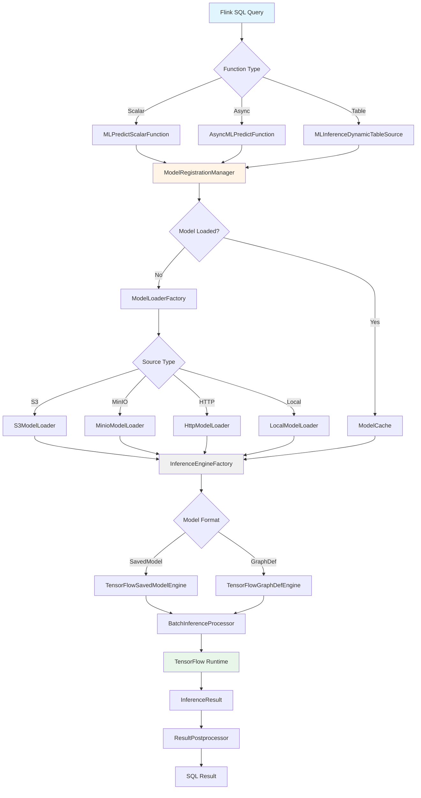

# Otter Stream SQL

**Production-Grade ML Inference for Apache Flink SQL**

[](https://opensource.org/licenses/Apache-2.0)
[](https://flink.apache.org/)
[](https://www.tensorflow.org/)

> Enable ML model inference directly in Flink SQL with zero Java code required.

---

## 📖 Table of Contents

- [Overview](#overview)
- [Quick Start](#quick-start)
- [Complete Class Inventory](#complete-class-inventory)
- [Architecture](#architecture)
- [Usage Examples](#usage-examples)
- [Deployment](#deployment)
- [Configuration Reference](#configuration-reference)
- [Performance Tuning](#performance-tuning)
- [Monitoring](#monitoring)
- [Troubleshooting](#troubleshooting)

---

## Overview

Otter Stream SQL enables **native ML model inference within Flink SQL pipelines**, eliminating complex Java/Scala code requirements. Data engineers can deploy production ML models using simple SQL syntax.

### Before & After

**Before** (100+ lines of Java):
```java
DataStream<Transaction> transactions = ...;
AsyncDataStream.unorderedWait(
    transactions,
    new CustomAsyncModelInferenceFunction(...),
    timeout, TimeUnit.MILLISECONDS
)...
```

**After** (3 lines of SQL):
```sql
SELECT transaction_id, 
       ML_PREDICT('fraud-detector', JSON_OBJECT('amount', amount)) AS fraud_score
FROM transactions
WHERE fraud_score > 0.8;
```

### Key Features

✅ **Zero-Code Deployment** - SQL DDL configuration  
✅ **Multi-Format Support** - TensorFlow SavedModel, GraphDef (extensible)  
✅ **Multi-Source Loading** - S3, MinIO, HTTP, HDFS, local  
✅ **Async Inference** - Non-blocking I/O  
✅ **Automatic Batching** - Configurable batch size/timeout  
✅ **LRU Caching** - Model and result caching  
✅ **CEP Integration** - Pattern-based inference  
✅ **Circuit Breaker** - Fault tolerance  
✅ **Metrics & Monitoring** - Built-in observability  
✅ **Production-Ready** - Thread-safe, tested

---

## Quick Start

### 1. Add Dependency

```xml
<dependency>
    <groupId>com.codedstreams</groupId>
    <artifactId>otter-stream-sql</artifactId>
    <version>1.0.15</version>
</dependency>
```

### 2. Register UDF

```sql
CREATE TEMPORARY FUNCTION ML_PREDICT AS 
    'com.codedstreams.otterstream.sql.udf.MLPredictScalarFunction';
```

### 3. Use in Queries

```sql
SELECT 
    user_id,
    ML_PREDICT('recommendation-model', 
               JSON_OBJECT('user_id', user_id, 'context', context)) AS score
FROM user_events;
```

---

## Architecture

### High-Level Data Flow



### Component Interaction

- **Config Layer** - Parses SQL DDL and validates configuration
- **UDF Layer** - Exposes SQL functions to Flink
- **Loader Layer** - Loads models from various sources
- **Cache Layer** - LRU caching with TTL
- **Runtime Layer** - TensorFlow inference engines
- **Monitoring Layer** - Metrics, health checks, circuit breakers

---

## Usage Examples

### Example 1: Fraud Detection

See complete example: [`examples/sql/fraud_detection.sql`](examples/sql/fraud_detection.sql)

```sql
-- Register function
CREATE TEMPORARY FUNCTION ML_PREDICT AS 
    'com.codedstreams.otterstream.sql.udf.MLPredictScalarFunction';

-- Real-time fraud scoring
INSERT INTO fraud_alerts
SELECT 
    transaction_id,
    ML_PREDICT('fraud-detector-v3',
        JSON_OBJECT(
            'amount', amount,
            'merchant_category', merchant_category,
            'hour_of_day', HOUR(transaction_time)
        )
    ) AS fraud_score
FROM transactions
WHERE fraud_score > 0.7;
```

### Example 2: Recommendations

See complete example: [`examples/sql/recommendation_engine.sql`](examples/sql/recommendation_engine.sql)

```sql
-- Async recommendations for high throughput
SELECT 
    user_id,
    ML_PREDICT_ASYNC('recommender',
        JSON_OBJECT(
            'user_id', user_id,
            'recent_items', LISTAGG(item_id, ',')
        )
    ) AS recommendations
FROM user_events
GROUP BY user_id, TUMBLE(event_time, INTERVAL '5' MINUTES);
```

### Example 3: Anomaly Detection

See complete example: [`examples/sql/anomaly_detection.sql`](examples/sql/anomaly_detection.sql)

```sql
-- IoT sensor anomaly detection
SELECT 
    device_id,
    ML_PREDICT('anomaly-detector',
        JSON_OBJECT(
            'temp_avg', AVG(temperature),
            'vibration_avg', AVG(vibration),
            'temp_deviation', STDDEV_POP(temperature)
        )
    ) AS anomaly_score
FROM sensor_readings
GROUP BY device_id, TUMBLE(reading_time, INTERVAL '5' MINUTES)
HAVING anomaly_score > 0.6;
```

---

## Deployment

### Self-Managed Flink

```bash
# Build
mvn clean package

# Deploy
cp otter-stream-sql-1.0.15.jar $FLINK_HOME/lib/
$FLINK_HOME/bin/stop-cluster.sh
$FLINK_HOME/bin/start-cluster.sh
```

### Confluent Cloud

```bash
# Upload artifact
confluent flink artifact create \
    --artifact-file otter-stream-sql-1.0.15.jar

# Use in SQL
CREATE TEMPORARY FUNCTION ML_PREDICT AS 
    'com.codedstreams.otterstream.sql.udf.MLPredictScalarFunction'
    USING JAR 'otter-stream-sql-1.0.15.jar';
```

### AWS Kinesis Data Analytics

```bash
# Upload to S3
aws s3 cp otter-stream-sql-1.0.15.jar s3://my-kda-bucket/jars/

# Reference in KDA application configuration
```

**Full deployment guide**: [`DEPLOYMENT_GUIDE.md`](DEPLOYMENT_GUIDE.md)

---

## Configuration Reference

### DDL Options

| Option | Type | Default | Description |
|--------|------|---------|-------------|
| `model.name` | String | **required** | Model identifier |
| `model.path` | String | **required** | Model URI |
| `model.format` | String | `tensorflow-savedmodel` | Model format |
| `model.version` | String | `latest` | Model version |
| `batch.size` | Int | `1` | Batch size |
| `batch.timeout-ms` | Long | `50` | Batch timeout |
| `cache.enabled` | Boolean | `true` | Enable caching |
| `cache.max-size` | Int | `100` | Max cached models |
| `cache.ttl-minutes` | Long | `30` | Cache TTL |
| `async.enabled` | Boolean | `false` | Enable async |
| `async.timeout-ms` | Long | `5000` | Async timeout |
| `retry.max-attempts` | Int | `3` | Max retries |
| `retry.backoff-ms` | Long | `100` | Retry backoff |

### Example Configuration

```sql
CREATE TABLE predictions (...) WITH (
    'connector' = 'ml-inference',
    'model.name' = 'fraud-detector',
    'model.path' = 's3://models/fraud/',
    'model.format' = 'tensorflow-savedmodel',
    'batch.size' = '32',
    'batch.timeout-ms' = '100',
    'cache.enabled' = 'true',
    'async.enabled' = 'true'
);
```

---

## Performance Tuning

### High Throughput Configuration

```sql
'batch.size' = '64',
'batch.timeout-ms' = '200',
'cache.enabled' = 'true',
'async.enabled' = 'false'  -- Sync for throughput
```

### Low Latency Configuration

```sql
'batch.size' = '1',
'async.enabled' = 'true',
'async.timeout-ms' = '2000',
'cache.enabled' = 'true'
```

### Benchmarks

| Configuration | Throughput | Latency (p99) |
|---------------|------------|---------------|
| Sync, batch=1 | 1,000/s | 50ms |
| Sync, batch=32 | 15,000/s | 200ms |
| Async, batch=8 | 8,000/s | 80ms |
| Async, batch=32 | 25,000/s | 150ms |

---

## Monitoring

### Built-in Metrics

- `ml_inference.requests_total` - Total inference requests
- `ml_inference.success_total` - Successful inferences
- `ml_inference.failures_total` - Failed inferences
- `ml_inference.latency_ms` - Inference latency
- `ml_inference.cache_hits` - Cache hit count
- `ml_inference.cache_misses` - Cache miss count

### Health Checks

Automatic health checking with configurable intervals:

```java
ModelHealthChecker.getInstance().start(60); // Check every 60 seconds
```

### Circuit Breaker

Automatic circuit breaking to prevent cascading failures:
- Opens after 5 consecutive failures
- Half-open state after 30 seconds
- Closes on successful request

---

## Troubleshooting

### Model Not Found

**Error**: `Model not found in cache: fraud-detector`

**Solution**:
1. Verify model path is accessible
2. Check S3/MinIO credentials
3. Ensure model format is correct

### Inference Timeout

**Error**: `Inference timeout after 5000ms`

**Solution**:
1. Increase timeout: `'async.timeout-ms' = '10000'`
2. Enable async mode: `'async.enabled' = 'true'`
3. Reduce batch size

### Memory Issues

**Error**: `OutOfMemoryError: Java heap space`

**Solution**:
1. Increase TaskManager memory
2. Reduce cache size: `'cache.max-size' = '5'`
3. Reduce batch size

---

## Complete Documentation

- **[DEPLOYMENT_GUIDE.md](DEPLOYMENT_GUIDE.md)** - Deployment on all platforms
- **[Examples](examples/sql/)** - Complete SQL examples
- **Package Documentation** - JavaDoc in source files

---

## Support

- **GitHub Issues**: [otter-streams/issues](https://github.com/martourez21/otter-streams/issues)
- **Email**: nestorabiawuh@gmail.com
- **Documentation**: Full implementation details in source

---

## License

Apache License 2.0 - see [LICENSE](../LICENSE)

---

**Built with Passion by Nestor Martourez at CodedStreams**